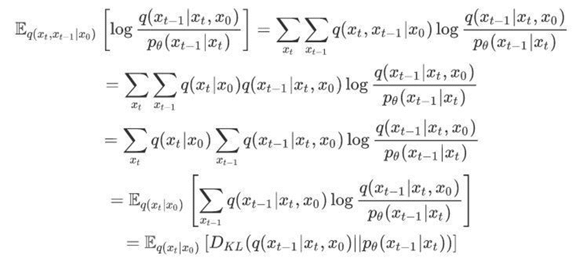

### DDPM (Denoising Diffusion Implicit Models)

目前所采用的扩散模型大都是来自于2020年的工作DDPM: Denoising Diffusion Probabilistic Models，DDPM对之前的扩散模型（具体见Deep Unsupervised Learning using Nonequilibrium Thermodynamics）进行了简化，并通过变分推断（variational inference）来进行建模，这主要是因为扩散模型也是一个隐变量模型（latent variable model），相比VAE这样的隐变量模型，扩散模型的隐变量是和原始数据是同维度的，而且推理过程（即扩散过程）往往是固定的。

#### 重点参考

- https://zhuanlan.zhihu.com/p/563661713
- https://chatgpt.com/c/e5825e80-d7ae-4795-9c44-7bd122746d1d

### 参考

- https://spaces.ac.cn/archives/9119
