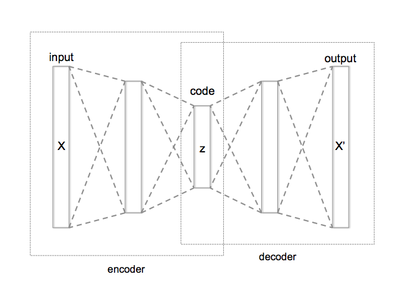
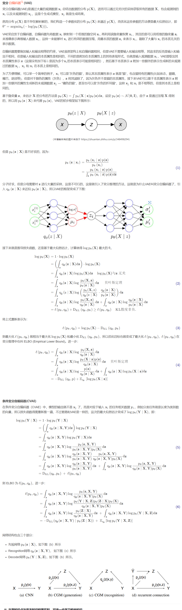
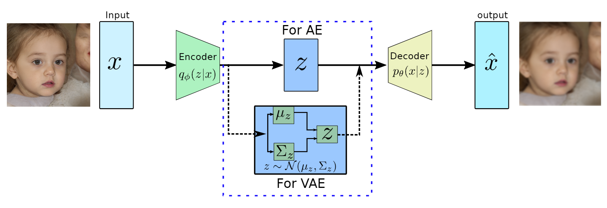
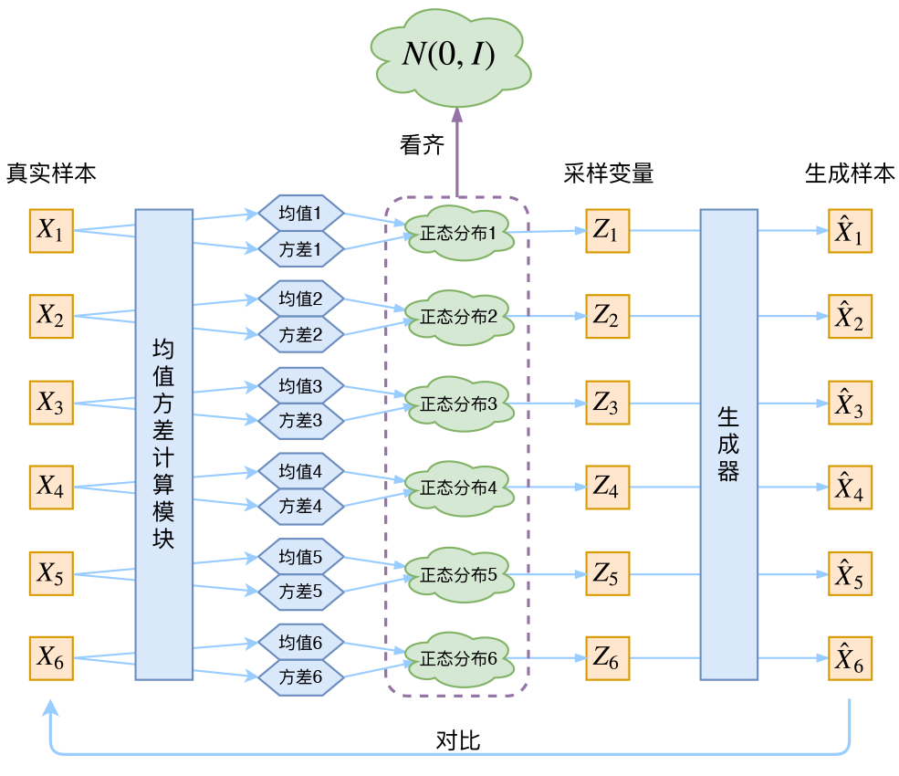

### AE (Autoencoder)

自编码的目的是：学习对高维数据做低维度“表示”

自编码器主要有两个部分组成：编码器和解码器

- 编码器训练得到函数 $\boldsymbol{f(·)}$
- 解码器训练得到函数 $\boldsymbol{g(·)}$

那么对于 input $\boldsymbol{X}$，Encoder编码过程为

$$\boldsymbol{z = f(X)}$$

其中z为编码向量，decoder解码过程为

$$\boldsymbol{X' = g(z)}$$

训练loss为重建损失

$$\boldsymbol{loss：||X-X'||}^2$$

这种方式编码向量z和输入X是一一对应的，只有与X对应的z才能通过解码过程重构X，任意的z通过解码过程重构结果没有明显的意义。这种方式只有降维编码的能力，没有diversity的生成能力。

### VAE (Variational Autoencoder)

变分自编码器在基本的自编码器的基础上引入了**概率模型**，通过最大化变分下界来进行训练，具有生成能力，能生成新的数据样本。

在自编码器的基础上引入了噪声，迫使模型去关注、抽象和编码那些重要、显著的特征，而基于这些特征，就可以生成新的和输入数据 **“和而不同”** 的样本，而不是像自编码器一样完全拟合输入数据且无法生成新的样本。

VAE是概率生成模型，编码器可将输入变量映射到与变分分布的参数相对应的潜空间（Latent Space），这样便可以产生多个遵循同一分布的不同样本

变分自编码器通过变分推理近似后验分布，并使用重构误差和KL散度联合优化模型。

贝叶斯定理：
$$
P(A \mid B)=\frac{P(A) P(B \mid A)}{P(B)}
$$

AE和VAE的区别：

VAE框架图：

#### 理论参考

- [变分自编码器和条件变分自编码器 (VAE & CVAE)](https://blog.csdn.net/qq_25602729/article/details/119980336)
- [变分自编码器（一）：原来是这么一回事](https://spaces.ac.cn/archives/5253)
- [变分自编码器（二）：从贝叶斯观点出发](https://spaces.ac.cn/archives/5343)
- [条件变分自编码器](https://chatgpt.com/c/e5825e80-d7ae-4795-9c44-7bd122746d1d)
- [贝叶斯定理](https://zh.wikipedia.org/wiki/%E8%B4%9D%E5%8F%B6%E6%96%AF%E5%AE%9A%E7%90%86)
- [KL散度](https://blog.csdn.net/smileyan9/article/details/114986479)
- [条件变分自编码器](https://zhuanlan.zhihu.com/p/389386601)

#### 公式推导参考

- https://www.zhangzhenhu.com/aigc/%E5%8F%98%E5%88%86%E8%87%AA%E7%BC%96%E7%A0%81%E5%99%A8.html
- https://www.jianshu.com/p/94d68a03c13e
- https://www.zywvvd.com/notes/study/deep-learning/generation/vae/cvae/cvae/
- https://zh.wikipedia.org/wiki/%E5%8F%98%E5%88%86%E8%87%AA%E7%BC%96%E7%A0%81%E5%99%A8

### CVAE (Conditional Variational Autoencoder)

### 参考

- https://spaces.ac.cn/archives/5253

- [Auto-Encoding Variational Bayes —— 2013-12](https://papers.cool/arxiv/1312.6114)