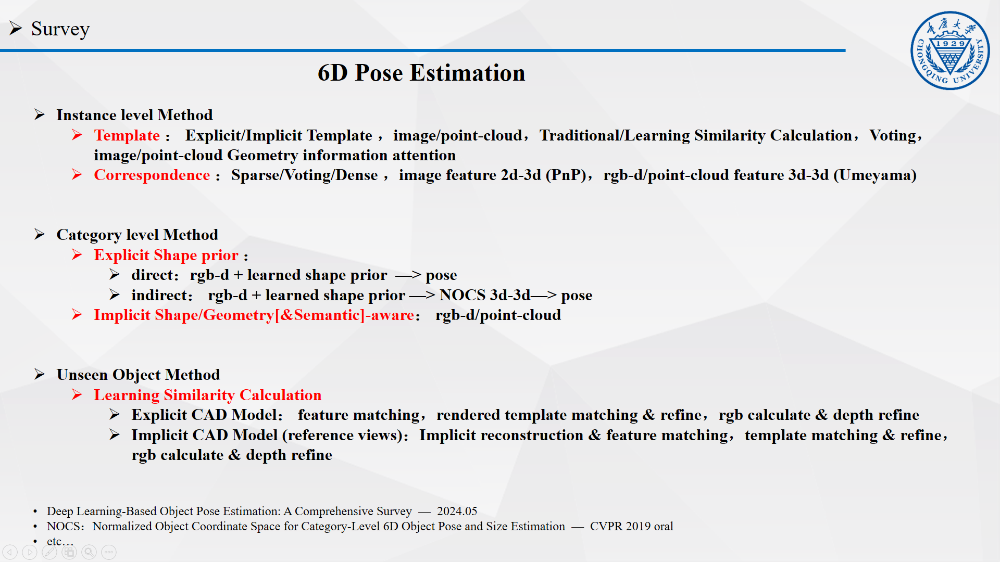
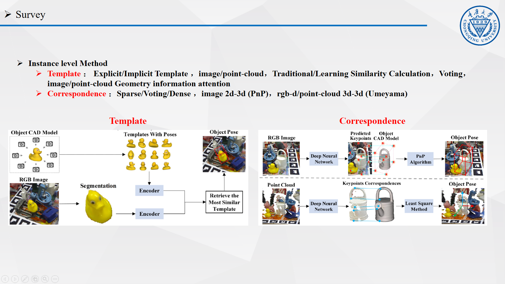
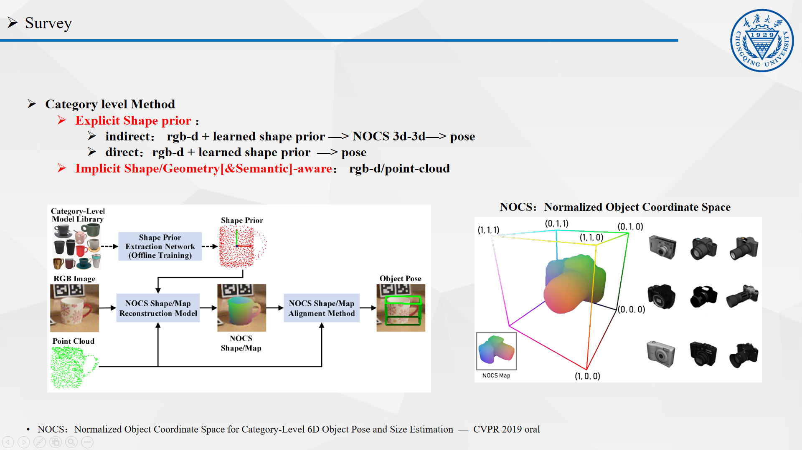
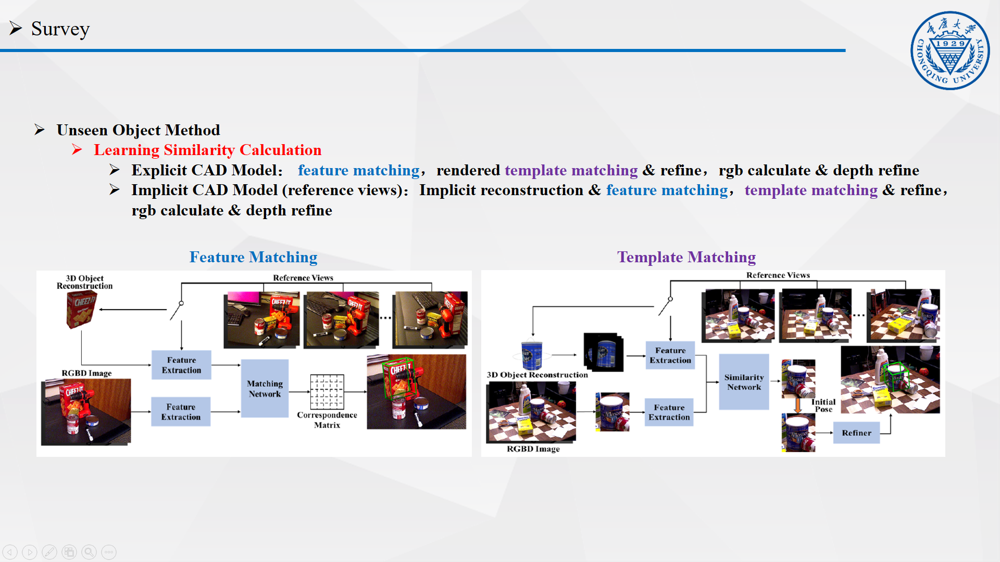

目前6D位姿估计主要有三个方向，instance level、category level、unseen object，对于instance level方法，模型没有泛化到新物体的能力，只能处理训练时见过的物体，存在一定的过拟合，但对于固定类别的任务，无论是速度精度鲁棒性都较为良好。对于category level方法，模型可以泛化到同一类的物体，比如不同品牌、不同型号的照相机。对于unseen object方法，模型可以泛化到从未见过的物体

对于instance level的方法，之前也提到过，主要分为两类，一类是基于模版的，一类是基于对应的，

基于模版的方法是左边这个图，核心在于在模板库中找到图像特征最接近的那个位姿，关键点之一是模版库的构建，有显式构建和隐式构建两种，显式构建的话主要是使用CAD模型利用渲染引擎OpenGL、blender这些来生成各个视角的图像构成模版库，隐式构建的话，主要是通过学习的方法，模型直接输入CAD模型，隐式的编码物体的特征，即一个隐式的模板库。另一个关键点事如何衡量最接近，此时会使用相似度计算，相似度计算的话也有传统方法和基于学习的方法，传统方法的话会使用一些特征描述符，特征点的描述符、图像块的描述符等等，通过点集或者图像块集等的方式来构建全局特征。基于学习的方法则直接通过网络提取特征，以feature map的形式来表示特征。对于输入的话，有只使用图像的方法，这类方法只使用图像特征来计算相似度，有使用rgb-d信息输入的方法，这类方法额外的深度信息可以计算相似度也可以用来做最后的位姿矫正。计算出相似度之后，对于最后位姿的选取，可以最直接的选择特征相似度最高的位姿，也可以采用KNN这种Voting的方式来从前topk中选择位姿。还有一些方法使用了几何信息的概念，在模型中增加几何信息的attention，从基本的图像特征或者点云特征上再attention抽象出几何信息，这对于位姿的估计是有很大帮助的，比如说鸭子的眼睛、嘴和尾巴的朝向能基本确定大致的鸭子位姿

基于对应的方法，核心是关键点检测，关键点可以是图像的关键点，也可以是点云上的关键点，提取关键点之后，能建立2d-3d或者3d-3d的对应，进而根据PnP或者一些基于距离的优化方法，比如umeyama，而关键点的话，可以是稀疏的关键点，比如物体最小外接长方体框的8个角点，或者在物体点云上用最远点采样得到的k个点，相比于直接预测关键点，也可以采用Voting的方式，每个像素或者每个3d点都预测对于关键点的投票，是一种密集的预测，根据投票结果，将得到更准确更鲁棒的关键点，但会密集预测会增加一些计算开销。还有一些方法直接预测密集的关键点，即每个像素和点云都作为一个关键点，模型输出一个correspondence map，表示每个像素或者3d点到3d模型3d点集中的映射，得到数据较多的2d-3d或者3d-3d对应，此时使用随机采样一致性（Ransac）结合Pnp和一些优化方法能获得更准确更鲁棒的位姿估计。

对于category level的方法，主要有两类，一类是基于显式的形状先验的，一类是基于隐式的几何建模的

对于基于显式的形状先验的方法，首先会使用一个模型从一类物体中提取shape特征，模型通常输入rgb-d数据，预测一个NOCS map，NOCS的话是一个归一化的坐标空间，而NOCS map的话是像素点到这个归一化坐标空间的映射，这个归一化坐标空间定义了一个物体坐标系，根据NOCS map，可以得到图像点到物体坐标系的映射，即可得到物体坐标系下的坐标，根据图像点的深度，可以得到相机系下的坐标，因此可以建立3d-3d的对应，从而求解物体的位姿。还有一些方法不预测中间的NOCS map，直接预测最终的物体位姿，此时模型会直接的关注图像点、形状先验、点云之间的对应关系

对于基于隐式几何建模的方法，不需要显式的对形状建模，能通过attention提取一类物体语义、几何、形状上的共性和关键Part，比如杯身和杯柄这样的语义能确定类别，杯柄对于确定位姿很关键。

对于unseen object方法，核心在于学习相似度计算，这种计算不依赖于某种特定的特征，是通用的，所以能在训练后泛化到新的场景物体，实现unseen object pose estimation。

可以分为使用3D模型和使用reference views，也可以分为基于特征匹配和基于模版匹配的

基于特征匹配的方法通过模型隐式的对物体语义、几何、形状等信息建模，可以输入3d模型或者参考视图，在推理时计算特征的相似度，输出一个correspondence matrix，然后基于参考视图的位姿标注，或者3D模型的物体坐标系来估计输入图像中物体的位姿。进一步可以使用深度来Refine估计的位姿。

基于模版匹配的方法通过查找特征最接近的参考视图来估计位姿。可以输入3D模型或者参考视图，3D模型的话会先渲染生成渲染图像，最终都会构建一个版本库，模型只需要学习参考视图和输入图像间的相似性度量即可，找到最接近的模版后，可获得初始位姿，可进一步使用深度来进行Refine。
