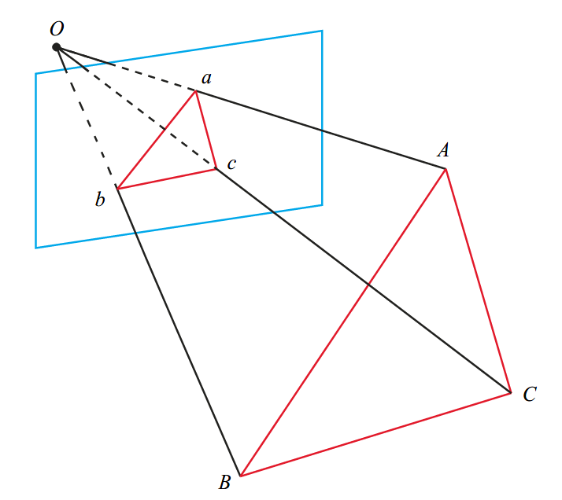

## PnP (Perspective-n-Point) 问题

PnP（Perspective-n-Point）是求解3D到2D点对运动的方法，描述当我们知道n个3D空间点以及它们在图像上的投影2D点，如何估计相机的位姿（位置和姿态）。

---

## PnP问题求解方法

### 1、DLT（Direct Linear Transform）

考虑某个空间点 $\boldsymbol{P}$ ，它的齐次坐标 $\boldsymbol{P} = (\boldsymbol{X,Y,Z,1})^{T}$。在图像 $\boldsymbol{I}_{1}$ 中，投影点 $\boldsymbol{x}_{1} = (u_{1},v_{1},1)^{T}$（以归一化平面齐次坐标表示）。此时相机的位姿 $\boldsymbol{R},\boldsymbol{t}$ 是未知的，定义增广矩阵 $\boldsymbol{T}=[\boldsymbol{R}|\boldsymbol{t}]$ 为一个 3x4 的矩阵，包含了旋转和平移信息，投影方程可以表示为：

$$s\left(\begin{array}{c}u_1 \\ v_1 \\ 1\end{array}\right)=\left(\begin{array}{cccc}t_1 & t_2 & t_3 & t_4 \\ t_5 & t_6 & t_7 & t_8 \\ t_9 & t_{10} & t_{11} & t_{12}\end{array}\right)\left(\begin{array}{c}X \\ Y \\ Z \\ 1\end{array}\right) \tag{1}$$.

式（1）的三行可展开为三个等式，将最后一行的等式代入前两行的等式得到：

$$u_1=\frac{t_1 X+t_2 Y+t_3 Z+t_4}{t_9 X+t_{10} Y+t_{11} Z+t_{12}} \quad v_1=\frac{t_5 X+t_6 Y+t_7 Z+t_8}{t_9 X+t_{10} Y+t_{11} Z+t_{12}} \tag{2}$$.

定义 $T$ 的行向量：

$$
\left\{\begin{array}{l}
\boldsymbol{t}_1=\left(t_1, t_2, t_3, t_4\right)^T \\
\boldsymbol{t}_2=\left(t_5, t_6, t_7, t_8\right)^T \\
\boldsymbol{t}_3=\left(t_9, t_{10}, t_{11}, t_{12}\right)^T
\end{array} \quad \right.
\tag{3}
$$

根据 $s*u_{1} - s*u_{1} = 0$ 联立式(1),(2),(3)得：

$$
\left\{\begin{array}{l}
\boldsymbol{t}_1^T \boldsymbol{P}-\boldsymbol{t}_3^T \boldsymbol{P} u_1=0 \\
\boldsymbol{t}_2^T \boldsymbol{P}-\boldsymbol{t}_3^T \boldsymbol{P} v_1=0
\end{array} \quad \right.
\tag{4}
$$

此时 $t$ 是一个待求的变量，由式(4)可知，每对投影点 $\boldsymbol{P} \leftrightarrow \boldsymbol{x}_{1}$ 提供两个关于 $\boldsymbol{t}$ 的线性约束，假设一共有 $N$ 对投影点，可得线性方程组：

$$
\left(\begin{array}{ccc}
\boldsymbol{P}_1^T & 0 & -u_1 \boldsymbol{P}_1^T \\
0 & \boldsymbol{P}_1^T & -v_1 \boldsymbol{P}_1^T \\
\vdots & \vdots & \vdots \\
\boldsymbol{P}_N^T & 0 & -u_N \boldsymbol{P}_N^T \\
0 & \boldsymbol{P}_N^T & -v_N \boldsymbol{P}_N^T
\end{array}\right)\left(\begin{array}{l}
\boldsymbol{t}_1 \\
\boldsymbol{t}_2 \\
\boldsymbol{t}_3
\end{array}\right)=0
\tag{5}
$$

由于 $\boldsymbol{t}$ 一共12维，因此最少通过6对投影点，即可实现矩阵 $\boldsymbol{T}$ 的线性求解。当投影点多于6对时，可以使用SVD等方法对超定方程求最小二乘解。

在DLT方法求解中，直接将 $\boldsymbol{T}$ 矩阵看成了12个未知数，忽略了它们之间的联系，因为旋转矩阵是正交矩阵，$\boldsymbol{R}∈\boldsymbol{SO(3)}$ ，用DLT方法求出的解不一定满足该约束，是一个一般矩阵。平移向量属于向量空间，可以直接使用，对于旋转矩阵 $\boldsymbol{R}$，必须针对DLT求出的 $\boldsymbol{T}$ 的左边 3x3 的矩阵块，寻找一个旋转矩阵来对它进行近似，这个近似可以由QR分解完成，相当于把结果从矩阵空间重新投影到 $\boldsymbol{SE(3)}$ 流形上，转换成旋转和平移两部分。

这里 $\boldsymbol{x}_{1}$ 使用的是归一化平面坐标，去掉了内参矩阵 $\boldsymbol{K}$ 的影响，也可以使用图像平面坐标，此时求解的是 $\boldsymbol{K,R,t}$ 三个量，但是由于未知量的增多，效果会差一些。

### 2、P3P

该方法仅使用3对3D-2D投影点对的几何关系，对数据要求较少，记世界坐标系下的3D点为 $\boldsymbol{A,B,C}$，对应的图像平面上的2D投影点为 $\boldsymbol{a,b,c}$，如下图所示，其中 $\boldsymbol{O}$ 是光心，此外P3P还需要使用一对验证点对 $\boldsymbol{D-d}$，以从可能的解中选出正确的那一个。

<center>

</center>

从原理上看，P3P方法利用三角形相似的性质，求解2D投影点 $\boldsymbol{a,b,c}$ 在相机坐标系下的3D坐标，将问题转换成一个3D到3D的位姿估计问题。

当然P3P方法也存在着一些问题，例如只使用了三个点的信息，当给定的配对点多于3组时，难以利用更多的信息；并且如果3D点或者2D点受噪声影响，或者存在误匹配，算法将失效。

#### 2.1、求3D点 $\boldsymbol{A,B,C}$ 在相机坐标系下的坐标

**首先根据图像平面上的2D投影点为 $\boldsymbol{a,b,c}$ 及相机内参求3D点为 $\boldsymbol{A,B,C}$ 在相机坐标系下的坐标**，在相机坐标系下，三角形之间存在对应的相似关系：

$$
\triangle O a b-\triangle O A B, \quad \triangle O b c-\triangle O B C, \quad \triangle O a c-\triangle O A C
$$

利用余弦定理有：

$$
\begin{aligned}
& O A^2+O B^2-2 O A \cdot O B \cdot \cos \langle a, b\rangle=A B^2 \\
& O B^2+O C^2-2 O B \cdot O C \cdot \cos \langle b, c\rangle=B C^2 \\
& O A^2+O C^2-2 O A \cdot O C \cdot \cos \langle a, c\rangle=A C^2
\end{aligned}
\tag{6}
$$

式(6)中的三个等式都除以 $O C^2$，并且记 $x=O A / O C,  y=O B / O C, v=A B^2 / O C^2, u v=B C^2 / O C^2, w v=A C^2 / O C^2$ 得：

$$
\begin{aligned}
& x^2+y^2-2 x y \cos \langle a, b\rangle-v=0 \\
& y^2+1^2-2 y \cos \langle b, c\rangle-u v=0 \\
& x^2+1^2-2 x \cos \langle a, c\rangle-w v=0 .
\end{aligned}
\tag{7}
$$

将式(7)中第一个等式代入第二、三个等式，消去 $v$ 得：

$$
\begin{aligned}
& (1-u) y^2-u x^2-\cos \langle b, c\rangle y+2 u x y \cos \langle a, b\rangle+1=0 \\
& (1-w) x^2-w y^2-\cos \langle a, c\rangle x+2 w x y \cos \langle a, b\rangle+1=0
\end{aligned}
\tag{8}
$$

由于2D点 $\boldsymbol{a,b,c}$ 已知，三个余弦角 $\cos \langle a, b\rangle, \cos \langle b, c\rangle, \cos \langle a, c\rangle$ 是已知的。同时 $u=B C^2 / A B^2, w=A C^2 / A B^2$ 可以通过 $\boldsymbol{A,B,C}$ 在世界坐标系下的坐标算出，变换到相机坐标系下之后，并不改变这个比值。因此式(8)中只有 $x,y$ 是未知的，随着相机移动会发生变化，是关于 $x,y$ 的二元二次方程，求其解析解需要用吴消元法，该方程最多可得到四个可能的解，需要用验证点对 $\boldsymbol{D-d}$ 找出最终的一个解，以得到 $\boldsymbol{A,B,C}$ 在相机坐标系下的3D坐标。

求出最可能得解 $x,y$ 后，可根据式(7)的第一个等式求出 $v$，然后根据 $x=O A / O C,  y=O B / O C, v=A B^2 / O C^2$ 可求出 $O A, O B, O C$，进一步根据 $O A, O B, O C$ 可求出 $\boldsymbol{A,B,C}$ 在相机坐标系下的坐标：

**以 $O A$ 为例**，记 $ x_{a}, y_{a} $ 为2D点 $\boldsymbol{a}$ 的图像坐标，$ X_{a}, Y_{a}, Z_{a} $ 为3D点 $\boldsymbol{A}$ 在相机坐标系下的坐标，$f$ 为相机焦距，

$$
\frac{\sqrt{x_{a}^2+y_{a}^2+f^2}}{O A}=\frac{x_{a}}{X_{a}}
$$

$$
X_{a}=\frac{x_{a} * O A}{\sqrt{x_{a}^2+y_{a}^2+f^2}}=\frac{\frac{x_{a}}{f_x} * O A}{\sqrt{\left(\frac{x_{a}}{f_x}\right)^2+\left(\frac{y_{a}}{f_y}\right)^2+1}}
$$

同理：

$$
Y_{a}=\frac{\frac{y_{a}}{f_x} * O A}{\sqrt{\left(\frac{x_{a}}{f_x}\right)^2+\left(\frac{y_{a}}{f_y}\right)^2+1}}
$$

$$
Z_{a}=\frac{\frac{z_{a}}{f_x} * O A}{\sqrt{\left(\frac{x_{a}}{f_x}\right)^2+\left(\frac{y_{a}}{f_y}\right)^2+1}}
$$

#### 2.2、求相机位姿 $\boldsymbol{T}=[\boldsymbol{R}|\boldsymbol{t}]$

由于3D点 $\boldsymbol{A,B,C}$ 在世界坐标系下的3D坐标是已知的，求出它们在相机坐标系下的3D坐标后，通过ICP方法即可求出相机的位姿。

### 3、EPnP[^1]

**前置条件：**
```
1. 可以将三维点表示为4个控制点的组合 (三维点的齐次坐标是控制点齐次坐标的线性组合)
2. 每个三维点的表示方式是唯一的，不随坐标系变换而改变。
```

#### 3.1 求解过程

1. **在世界坐标系下计算三维点的4个控制点：**
一个点选为重心，另外三个点根据 重心加主方向上的方向向量 得到

2. **计算世界坐标系下三维点相对于控制点的表示，即计算出 $α_{ij}$：**

$$
\left[\begin{array}{c}
\mathbf{p}_i^w \\
1
\end{array}\right]=\underbrace{\left[\begin{array}{cccc}
\mathbf{c}_1^w & \mathbf{c}_2^w & \mathbf{c}_3^w & \mathbf{c}_4^w \\
1 & 1 & 1 & 1
\end{array}\right]}_{\mathbf{C}}\left[\begin{array}{l}
\alpha_{i 1} \\
\alpha_{i 2} \\
\alpha_{i 3} \\
\alpha_{i 4}
\end{array}\right]
\tag{9}
$$

3. **利用相机投影模型计算三维点在相机坐标系下的控制点**

$$
\omega_i\left[\begin{array}{c}
\mathbf{u}_i \\
1
\end{array}\right]=\mathbf{K} \mathbf{p}_i^c=\mathbf{K} \sum_{j=1}^4 \alpha_{i j} \mathbf{c}_j^c=\left[\begin{array}{ccc}
f_x & 0 & c_x \\
0 & f_y & c_y \\
0 & 0 & 1
\end{array}\right] \sum_{j=1}^4 \alpha_{i j}\left[\begin{array}{c}
x_j^c \\
y_j^c \\
z_j^c
\end{array}\right]
\tag{10}
$$

4. **根据前置条件1，相机坐标系下三维点相对于控制点的表示，也为式（9）中计算出的 $α_{ij}$，结合式（10）计算得到的控制点在相机坐标系下的表示，可恢复出三维点在相机坐标系下的坐标**

$$
\mathbf{p}_i^c=[\mathbf{R} \mid \mathbf{t}]\left[\begin{array}{c}
\mathbf{p}_i^w \\
1
\end{array}\right]=[\mathbf{R} \mid \mathbf{t}]\left[\begin{array}{c}
\sum_{j=1}^4 \alpha_{i j} \mathbf{c}_j^w \\
\sum_{j=1}^4 \alpha_{i j}
\end{array}\right]=\sum_{j=1}^4 \alpha_{i j} \mathbf{c}_j^c
\tag{11}
$$

5. **求相机位姿 $\boldsymbol{T}=[\boldsymbol{R}|\boldsymbol{t}]$**
由于3D点在世界坐标系下的3D坐标是已知的，求出它们在相机坐标系下的3D坐标后，通过ICP方法即可求出相机的位姿。

#### 3.2 理论推导

##### 前置条件证明

记点对的数量为 $n$，三维点的非齐次坐标为

$$
\mathbf{p}_i, \quad i=1, \cdots, n
$$

利用上标 $^c$ 和 $^w$ 代表三维点在相机和世界坐标系下对应的坐标。EPnP引入了控制点，任何一个3D点都可以表示为四个控制点的线性组合。四个控制点的三维坐标记为

$$
\mathbf{c}_j, \quad j=1, \cdots, 4
$$

**世界坐标系**下的每个三维点可以由4个控制点表达为

$$
\begin{gathered}
\mathbf{p}_i^w=\sum_{j=1}^4 \alpha_{i j} \mathbf{c}_j^w \\
\sum_{j=1}^4 \alpha_{i j}=1
\end{gathered}
\tag{12}
$$

式中的 $α_{ij}$ 为齐次重心坐标(homogeneous barycentric coordinates)，可记为hb坐标。式（12）还可写为

$$
\left[\begin{array}{c}
\mathbf{p}_i^w \\
1
\end{array}\right]=\underbrace{\left[\begin{array}{cccc}
\mathbf{c}_1^w & \mathbf{c}_2^w & \mathbf{c}_3^w & \mathbf{c}_4^w \\
1 & 1 & 1 & 1
\end{array}\right]}_{\mathbf{C}}\left[\begin{array}{l}
\alpha_{i 1} \\
\alpha_{i 2} \\
\alpha_{i 3} \\
\alpha_{i 4}
\end{array}\right]
\tag{13}
$$

实际上，3D点的齐次坐标被表示为控制点齐次坐标的线性组合。记待求解的相机与世界坐标系之间的相对位姿为 $\boldsymbol{T}=[\boldsymbol{R}|\boldsymbol{t}]$，控制点在相机坐标系下的坐标为

$$
\mathbf{c}_j^c=[\mathbf{R} \mid \mathbf{t}]\left[\begin{array}{c}
\mathbf{c}_j^w \\
1
\end{array}\right]
\tag{14}
$$

那么对于一个三维点，在相机坐标系下可表示为
$$
\mathbf{p}_i^c=[\mathbf{R} \mid \mathbf{t}]\left[\begin{array}{c}
\mathbf{p}_i^w \\
1
\end{array}\right]=[\mathbf{R} \mid \mathbf{t}]\left[\begin{array}{c}
\sum_{j=1}^4 \alpha_{i j} \mathbf{c}_j^w \\
\sum_{j=1}^4 \alpha_{i j}
\end{array}\right]=\sum_{j=1}^4 \alpha_{i j} \mathbf{c}_j^c
\tag{15}
$$

由式（12）和式（15）可见同一3D点在世界坐标系下的hb坐标与其在相机坐标系下的hb坐标相同。因此可以预先在世界坐标系下计算hb坐标 $α_{ij}$，然后作为已知量在相机坐标系下使用。

### 4、Bundle Adjustment

可以把 PnP 问题构建为一个定义在李代数上的非线性最小二乘问题，通过最小化重投影误差来求解相机位姿，考虑 n 个三维空间点 $\boldsymbol{P}_i=\left[X_i, Y_i, Z_i\right]^T$ 和它们的投影点 $\boldsymbol{u}_i=\left[u_i, v_i\right]^T$ ，计算相机的位姿 $R,t$ ，相机位姿的李代数表示为 $ξ$，投影点和三维空间点的关系为：

$$
s_i\left[\begin{array}{c}
u_i \\
v_i \\
1
\end{array}\right]=\boldsymbol{K} \exp \left(\boldsymbol{\xi}^{\wedge}\right)\left[\begin{array}{c}
X_i \\
Y_i \\
Z_i \\
1
\end{array}\right]
\tag{16}
$$

写成矩阵形式为：

$$
s_i \boldsymbol{u}_i=\boldsymbol{K} \exp \left(\boldsymbol{\xi}^{\wedge}\right) \boldsymbol{P}_i
\tag{17}
$$

由于相机位姿未知以及观测点的噪声，观测图像点和对应的三维空间点的投影点之间存在一个误差，将误差求和，构建最小二乘问题：

$$
\boldsymbol{\xi}^*=\arg \min _{\boldsymbol{\xi}} \frac{1}{2} \sum_{i=1}^n\left\|\boldsymbol{u}_i-\frac{1}{s_i} \boldsymbol{K} \exp \left(\boldsymbol{\xi}^{\wedge}\right) \boldsymbol{P}_i\right\|_2^2
\tag{18}
$$

该问题的误差项是重投影误差，是像素坐标（观测到的投影位置）与 3D 点按照当前估计的位姿投影得到的像素坐标之间的误差。使用李代数来表示位姿，可以将问题构建为无约束的优化问题，进而通过G-N，L-M等优化算法进行求解。使用优化算法需要知道每个误差项关于优化变量的导数，也就是线性化

$$
e(\boldsymbol{x}+\Delta \boldsymbol{x}) \approx \boldsymbol{e}(\boldsymbol{x})+\boldsymbol{J} \Delta \boldsymbol{x}
\tag{19}
$$

当 $e$ 为像素坐标误差（2维），$x$ 为相机位姿（6维）时，雅可比矩阵 $J$ 的维度为2x6，记相机坐标系下的3D点为 $\boldsymbol{P}^{\prime}$：

$$
\boldsymbol{P}^{\prime}=\left(\exp \left(\boldsymbol{\xi}^{\wedge}\right) \boldsymbol{P}\right)_{1: 3}=\left[X^{\prime}, Y^{\prime}, Z^{\prime}\right]^T
\tag{20}
$$

由相机投影模型可得：

$$
s \boldsymbol{u}=\boldsymbol{K} \boldsymbol{P}^{\prime}
\tag{21}
$$

展开写为矩阵形式：

$$
\left[\begin{array}{l}
s u \\
s v \\
s
\end{array}\right]=\left[\begin{array}{ccc}
f_x & 0 & c_x \\
0 & f_y & c_y \\
0 & 0 & 1
\end{array}\right]\left[\begin{array}{c}
X^{\prime} \\
Y^{\prime} \\
Z^{\prime}
\end{array}\right]
\tag{22}
$$

利用第3行消去 $s$，实质上是将相机坐标系下的3D点换算到归一化平面坐标系，得到：

$$
u=f_x \frac{X^{\prime}}{Z^{\prime}}+c_x, \quad v=f_y \frac{Y^{\prime}}{Z^{\prime}}+c_y
\tag{23}
$$

利用李代数上的左乘扰动，重投影误差 $e([u_1-u_2, v_1-v_2])$ 对于相机位姿的导数为：

$$
\frac{\partial \boldsymbol{e}}{\partial \delta \boldsymbol{\xi}}=\lim _{\delta \boldsymbol{\xi} \rightarrow 0} \frac{e(\delta \boldsymbol{\xi} \oplus \boldsymbol{\xi})}{\delta \boldsymbol{\xi}}=\frac{\partial \boldsymbol{e}}{\partial \boldsymbol{P}^{\prime}} \frac{\partial \boldsymbol{P}^{\prime}}{\partial \delta \boldsymbol{\xi}}
\tag{24}
$$

式 (24) 中乘积的第一项为重投影误差相对于相机坐标系下的3D坐标的导数，根据式 (22) 可得

$$
\frac{\partial \boldsymbol{e}}{\partial \boldsymbol{P}^{\prime}}=-\left[\begin{array}{ccc}
\frac{\partial u}{\partial X^{\prime}} & \frac{\partial u}{\partial Y^{\prime}} & \frac{\partial u}{\partial Z^{\prime}} \\
\frac{\partial v}{\partial X^{\prime}} & \frac{\partial v}{\partial Y^{\prime}} & \frac{\partial v}{\partial Z^{\prime}}
\end{array}\right]=-\left[\begin{array}{ccc}
\frac{f_x}{Z^{\prime}} & 0 & -\frac{f_x X^{\prime}}{Z^{\prime 2}} \\
0 & \frac{f_y}{Z^{\prime}} & -\frac{f_y Y^{\prime}}{Z^{\prime 2}}
\end{array}\right]
\tag{25}
$$

式 (24) 中乘积的第二项为相机坐标系下的3D坐标相对于李代数表示的位姿的导数：

$$
\frac{\partial(\boldsymbol{T} \boldsymbol{P})}{\partial \delta \boldsymbol{\xi}}=(\boldsymbol{T} \boldsymbol{P})^{\odot}=\left[\begin{array}{cc}
\boldsymbol{I} & -\boldsymbol{P}^{\prime \wedge} \\
\mathbf{0}^T & \mathbf{0}^T
\end{array}\right]
\tag{26}
$$

取式 (26) 的前三维得到维度为3x6的导数：

$$
\frac{\partial \boldsymbol{P}^{\prime}}{\partial \delta \boldsymbol{\xi}}=\left[\boldsymbol{I},-\boldsymbol{P}^{\prime \wedge}\right]
\tag{27}
$$

将式 (25) 和式 (27) 相乘得到重投影误差对于李代数表示的相机位姿的导数，维度为2x6：

$$
\frac{\partial \boldsymbol{e}}{\partial \delta \boldsymbol{\xi}}=-\left[\begin{array}{cccccc}
\frac{f_x}{Z^{\prime}} & 0 & -\frac{f_x X^{\prime}}{Z^{\prime 2}} & -\frac{f_x X^{\prime} Y^{\prime}}{Z^{\prime 2}} & f_x+\frac{f_x X^2}{Z^{\prime 2}} & -\frac{f_x Y^{\prime}}{Z^{\prime}} \\
0 & \frac{f_y}{Z^{\prime}} & -\frac{f_y Y^{\prime}}{Z^{\prime 2}} & -f_y-\frac{f_y Y^{\prime 2}}{Z^{\prime 2}} & \frac{f_y X^{\prime} Y^{\prime}}{Z^{\prime 2}} & \frac{f_y X^{\prime}}{Z^{\prime}}
\end{array}\right]
\tag{28}
$$

重投影误差对于世界坐标系下3D点的导数，由链式法则得：

$$
\frac{\partial \boldsymbol{e}}{\partial \boldsymbol{P}}=\frac{\partial \boldsymbol{e}}{\partial \boldsymbol{P}^{\prime}} \frac{\partial \boldsymbol{P}^{\prime}}{\partial \boldsymbol{P}}
\tag{29}
$$

根据空间点变换关系：

$$
\boldsymbol{P}^{\prime}=\exp \left(\boldsymbol{\xi}^{\wedge}\right) \boldsymbol{P}=\boldsymbol{R} \boldsymbol{P}+\boldsymbol{t}
\tag{30}
$$

可得，相机坐标系下的3D点对于世界坐标系下的3D点的导数为 $R$，因此，结合式 (25)，式 (29) 可写为：

$$
\frac{\partial \boldsymbol{e}}{\partial \boldsymbol{P}}=-\left[\begin{array}{ccc}
\frac{f_x}{Z^{\prime}} & 0 & -\frac{f_x X^{\prime}}{Z^{\prime 2}} \\
0 & \frac{f_y}{Z^{\prime}} & -\frac{f_y Y^{\prime}}{Z^{\prime 2}}
\end{array}\right] \boldsymbol{R}
\tag{31}
$$

根据式 (28)、式 (31)，可以分别求取重投影误差相对与相机位姿和世界坐标系下3D点的导数，为非线性优化提供梯度方向。

Bundle Adjustment 优化算法也可以使用于多视图中，即同时考虑多个视图的重投影误差。

## 参考

- 视觉SLAM十四讲
- [P3P推导](https://www.cnblogs.com/excellentlhw/p/10776316.html)
- [EPnP解法](https://zhuanlan.zhihu.com/p/59070440)
- [EPnP简介](https://www.guyuehome.com/19581)
- [深入EPnP算法](https://blog.csdn.net/jessecw79/article/details/82945918#control_points_64)

[^1]: Lepetit, V.; Moreno-Noguer, F.; Fua, P. Epnp: Efficient perspective-n-point camera pose estimation. International Journal of Computer Vision 2009, 81, 155-166.
