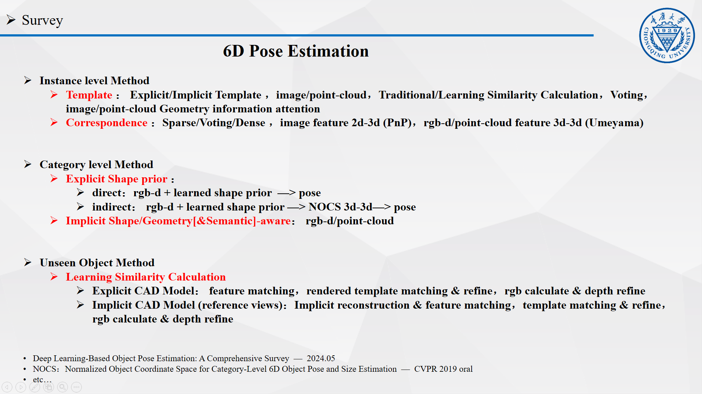

## PnP (Perspective-n-Point) 问题

PnP（Perspective-n-Point）是求解3D到2D点对运动的方法，描述当我们知道n个3D空间点以及它们在图像上的投影2D点，如何估计相机的位姿（位置和姿态）。

---

## PnP问题求解方法

### 1、DLT（Direct Linear Transform）

考虑某个空间点 $\boldsymbol{P}$ ，它的齐次坐标 $\boldsymbol{P} = (\boldsymbol{X,Y,Z,1})^{T}$。在图像 $\boldsymbol{I}_{1}$ 中，投影点 $\boldsymbol{x}_{1} = (u_{1},v_{1},1)^{T}$（以归一化平面齐次坐标表示）。此时相机的位姿 $\boldsymbol{R},\boldsymbol{t}$ 是未知的，定义增广矩阵 $\boldsymbol{T}=[\boldsymbol{R}|\boldsymbol{t}]$ 为一个 3x4 的矩阵，包含了旋转和平移信息，投影方程可以表示为：

$$s\left(\begin{array}{c}u_1 \\ v_1 \\ 1\end{array}\right)=\left(\begin{array}{cccc}t_1 & t_2 & t_3 & t_4 \\ t_5 & t_6 & t_7 & t_8 \\ t_9 & t_{10} & t_{11} & t_{12}\end{array}\right)\left(\begin{array}{c}X \\ Y \\ Z \\ 1\end{array}\right) \tag{1}$$.

式（1）的三行可展开为三个等式，将最后一行的等式代入前两行的等式得到：

$$u_1=\frac{t_1 X+t_2 Y+t_3 Z+t_4}{t_9 X+t_{10} Y+t_{11} Z+t_{12}} \quad v_1=\frac{t_5 X+t_6 Y+t_7 Z+t_8}{t_9 X+t_{10} Y+t_{11} Z+t_{12}} \tag{2}$$.

定义 $T$ 的行向量：

$$
\left\{\begin{array}{l}
\boldsymbol{t}_1=\left(t_1, t_2, t_3, t_4\right)^T \\
\boldsymbol{t}_2=\left(t_5, t_6, t_7, t_8\right)^T \\
\boldsymbol{t}_3=\left(t_9, t_{10}, t_{11}, t_{12}\right)^T
\end{array} \quad \right.
\tag{3}
$$

根据 $s*u_{1} - s*u_{1} = 0$ 联立式(1),(2),(3)得：

$$
\left\{\begin{array}{l}
\boldsymbol{t}_1^T \boldsymbol{P}-\boldsymbol{t}_3^T \boldsymbol{P} u_1=0 \\
\boldsymbol{t}_2^T \boldsymbol{P}-\boldsymbol{t}_3^T \boldsymbol{P} v_1=0
\end{array} \quad \right.
\tag{4}
$$

此时 $t$ 是一个待求的变量，由式(4)可知，每对投影点 $\boldsymbol{P} \leftrightarrow \boldsymbol{x}_{1}$ 提供两个关于 $\boldsymbol{t}$ 的线性约束，假设一共有 $N$ 对投影点，可得线性方程组：

$$
\left(\begin{array}{ccc}
\boldsymbol{P}_1^T & 0 & -u_1 \boldsymbol{P}_1^T \\
0 & \boldsymbol{P}_1^T & -v_1 \boldsymbol{P}_1^T \\
\vdots & \vdots & \vdots \\
\boldsymbol{P}_N^T & 0 & -u_N \boldsymbol{P}_N^T \\
0 & \boldsymbol{P}_N^T & -v_N \boldsymbol{P}_N^T
\end{array}\right)\left(\begin{array}{l}
\boldsymbol{t}_1 \\
\boldsymbol{t}_2 \\
\boldsymbol{t}_3
\end{array}\right)=0
\tag{5}
$$

由于 $\boldsymbol{t}$ 一共12维，因此最少通过6对投影点，即可实现矩阵 $\boldsymbol{T}$ 的线性求解。当投影点多于6对时，可以使用SVD等方法对超定方程求最小二乘解。

在DLT方法求解中，直接将 $\boldsymbol{T}$ 矩阵看成了12个未知数，忽略了它们之间的联系，因为旋转矩阵是正交矩阵，$\boldsymbol{R}∈\boldsymbol{SO(3)}$ ，用DLT方法求出的解不一定满足该约束，是一个一般矩阵。平移向量属于向量空间，可以直接使用，对于旋转矩阵 $\boldsymbol{R}$，必须针对DLT求出的 $\boldsymbol{T}$ 的左边 3x3 的矩阵块，寻找一个旋转矩阵来对它进行近似，这个近似可以由QR分解完成，相当于把结果从矩阵空间重新投影到 $\boldsymbol{SE(3)}$ 流形上，转换成旋转和平移两部分。

这里 $\boldsymbol{x}_{1}$ 使用的是归一化平面坐标，去掉了内参矩阵 $\boldsymbol{K}$ 的影响，也可以使用图像平面坐标，此时求解的是 $\boldsymbol{K,R,t}$ 三个量，但是由于未知量的增多，效果会差一些。

### 2、P3P

该方法仅使用3对3D-2D投影点对的几何关系，对数据要求较少，记世界坐标系下的3D点为 $\boldsymbol{A,B,C}$，对应的图像平面上的2D投影点为 $\boldsymbol{a,b,c}$，如下图所示，其中 $\boldsymbol{O}$ 是光心，此外P3P还需要使用一对验证点对 $\boldsymbol{D-d}$，以从可能的解中选出正确的那一个。

从原理上看，P3P方法利用三角形相似[^1]的性质，求解2D投影点 $\boldsymbol{a,b,c}$ 在相机坐标系下的3D坐标，将问题转换成一个3D到3D的位姿估计问题。

当然P3P方法也存在着一些问题，例如只使用了三个点的信息，当给定的配对点多于3组时，难以利用更多的信息；并且如果3D点或者2D点受噪声影响，或者存在误匹配，算法将失效。

#### 2.1、求3D点 $\boldsymbol{A,B,C}$ 在相机坐标系下的坐标

**首先根据图像平面上的2D投影点为 $\boldsymbol{a,b,c}$ 及相机内参求3D点为 $\boldsymbol{A,B,C}$ 在相机坐标系下的坐标**，在相机坐标系下，三角形之间存在对应的相似关系：

$$
\triangle O a b-\triangle O A B, \quad \triangle O b c-\triangle O B C, \quad \triangle O a c-\triangle O A C
$$

利用余弦定理有：

$$
\begin{aligned}
& O A^2+O B^2-2 O A \cdot O B \cdot \cos \langle a, b\rangle=A B^2 \\
& O B^2+O C^2-2 O B \cdot O C \cdot \cos \langle b, c\rangle=B C^2 \\
& O A^2+O C^2-2 O A \cdot O C \cdot \cos \langle a, c\rangle=A C^2
\end{aligned}
\tag{6}
$$

式(6)中的三个等式都除以 $O C^2$，并且记 $x=O A / O C,  y=O B / O C, v=A B^2 / O C^2, u v=B C^2 / O C^2, w v=A C^2 / O C^2$ 得：

$$
\begin{aligned}
& x^2+y^2-2 x y \cos \langle a, b\rangle-v=0 \\
& y^2+1^2-2 y \cos \langle b, c\rangle-u v=0 \\
& x^2+1^2-2 x \cos \langle a, c\rangle-w v=0 .
\end{aligned}
\tag{7}
$$

将式(7)中第一个等式代入第二、三个等式，消去 $v$ 得：

$$
\begin{aligned}
& (1-u) y^2-u x^2-\cos \langle b, c\rangle y+2 u x y \cos \langle a, b\rangle+1=0 \\
& (1-w) x^2-w y^2-\cos \langle a, c\rangle x+2 w x y \cos \langle a, b\rangle+1=0
\end{aligned}
\tag{8}
$$

由于2D点 $\boldsymbol{a,b,c}$ 已知，三个余弦角 $\cos \langle a, b\rangle, \cos \langle b, c\rangle, \cos \langle a, c\rangle$ 是已知的。同时 $u=B C^2 / A B^2, w=A C^2 / A B^2$ 可以通过 $\boldsymbol{A,B,C}$ 在世界坐标系下的坐标算出，变换到相机坐标系下之后，并不改变这个比值。因此式(8)中只有 $x,y$ 是未知的，随着相机移动会发生变化，是关于 $x,y$ 的二元二次方程，求其解析解需要用吴消元法，该方程最多可得到四个可能的解，需要用验证点对 $\boldsymbol{D-d}$ 找出最终的一个解，以得到 $\boldsymbol{A,B,C}$ 在相机坐标系下的3D坐标。

求出最可能得解 $x,y$ 后，可根据式(7)的第一个等式求出 $v$，然后根据 $x=O A / O C,  y=O B / O C, v=A B^2 / O C^2$ 可求出 $O A, O B, O C$，进一步根据 $O A, O B, O C$ 可求出 $\boldsymbol{A,B,C}$ 在相机坐标系下的坐标：

**以 $O A$ 为例**，记 $ x_{a}, y_{a} $ 为2D点 $\boldsymbol{a}$ 的图像坐标，$ X_{a}, Y_{a}, Z_{a} $ 为3D点 $\boldsymbol{A}$ 在相机坐标系下的坐标，$f$ 为相机焦距，

$$
\frac{\sqrt{x_{a}^2+y_{a}^2+f^2}}{O A}=\frac{x_{a}}{X_{a}}
$$

$$
X_{a}=\frac{x_{a} * O A}{\sqrt{x_{a}^2+y_{a}^2+f^2}}=\frac{\frac{x_{a}}{f_x} * O A}{\sqrt{\left(\frac{x_{a}}{f_x}\right)^2+\left(\frac{y_{a}}{f_y}\right)^2+1}}
$$

同理：

$$
Y_{a}=\frac{\frac{y_{a}}{f_x} * O A}{\sqrt{\left(\frac{x_{a}}{f_x}\right)^2+\left(\frac{y_{a}}{f_y}\right)^2+1}}
$$

$$
Z_{a}=\frac{\frac{z_{a}}{f_x} * O A}{\sqrt{\left(\frac{x_{a}}{f_x}\right)^2+\left(\frac{y_{a}}{f_y}\right)^2+1}}
$$

#### 2.2、求相机位姿 $\boldsymbol{T}=[\boldsymbol{R}|\boldsymbol{t}]$

由于3D点 $\boldsymbol{A,B,C}$ 在世界坐标系下的3D坐标是已知的，求出它们在相机坐标系下的3D坐标后，通过ICP方法即可求出相机的位姿。

### 3、EPnP[^2]

### 4、Bundle Adjustment

## 参考

- 视觉SLAM十四讲
- [P3P推导](https://www.cnblogs.com/excellentlhw/p/10776316.html)
- [EPnP解法](https://zhuanlan.zhihu.com/p/59070440)

[^1]:相似三角形的判定定理：
    - 1、两条边共线，另一条边平行
	- 2、两个角对应相等
	- 3、一个角对应相等，两邻边对应成比例
	- 4、三边对应成比例
    - 5、直角三角形一条直角边和一条邻边对应成比例
[^2]: Lepetit, V.; Moreno-Noguer, F.; Fua, P. Epnp: Efficient perspective-n-point camera pose estimation. International Journal of Computer Vision 2009, 81, 155-166.
