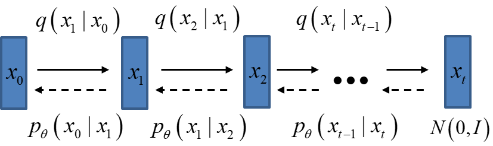
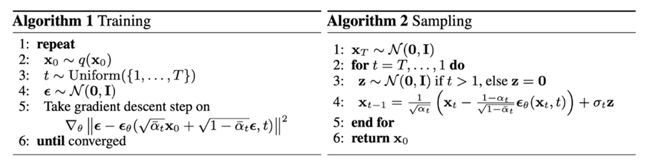

## DDPM (Denoising Diffusion Implicit Models)

目前所采用的扩散模型大都是来自于2020年的工作DDPM[^1]，DDPM对之前的扩散模型DULNT[^2]进行了简化，并通过变分推断（variational inference）来进行建模，这主要是因为扩散模型也是一个隐变量模型（latent variable model），相比VAE这样的隐变量模型，扩散模型的隐变量是和原始数据是同维度的，而且推理过程（即扩散过程）往往是固定的。

具体而言，去噪扩散概率模型DDPM，结合了扩散过程和去噪自编码器的思想，包括两个过程：前向的扩散过程，逐步向数据添加噪声，直到数据变为纯噪声；反向过程，通过去噪从纯噪声逐步生成数据。两个过程都是一个参数化的马尔科夫链（Markov chain），其中反向过程可以用来生成数据，最终建模求解的就是反向过程。

### 前向扩散过程

扩散过程是指的对数据逐渐增加高斯噪音直至数据变成随机噪音的过程。对于原始数据 $\mathbf{x}_0∼q(\mathbf{x}_0)$ ，经过如下的 $T$ 步增加噪声的迭代，最终变成随机噪声 ${\mathbf{x}_T} \sim \mathcal{N}(0, I)$：

$$
q\left(\mathbf{x}_t \mid \mathbf{x}_{t-1}\right)=\mathcal{N}\left(\mathbf{x}_t ; \sqrt{1-\beta_t} \mathbf{x}_{t-1}, \beta_t \mathbf{I}\right)
$$

这里的 $\left\{\beta_t\right\}_{t=1}^T$ 为每一步所采用的方差，介于 $0~1$ 之间。对于扩散模型，我们往往称不同 step 的方差设定为 variance schedule 或者 noise schedule，通常情况下，越后面的 step 会采用更大的方差，即满足 $\beta_1<\beta_2<\cdots<\beta_T$。在一个设计好的 variance schedule 下，如果扩散步数 $T$ 足够大，那么最终得到的 $\mathbf{x}_T$ 就完全丢失了原始数据而变成了一个随机噪音。 扩散过程的每一步都生成一个带噪音的数据 $\mathbf{x}_t$，整个扩散过程也就是一个马尔卡夫链：

$$
q\left(\mathbf{x}_{1: T} \mid \mathbf{x}_0\right)=\prod_{t=1}^T q\left(\mathbf{x}_t \mid \mathbf{x}_{t-1}\right)
$$

由于扩散过程是预先固定的，即采用一个预先定义好的variance schedule，比如DDPM就采用一个线性的variance schedule。基于预定义的variance schedule，我们就可以直接基于原始数据 $\mathbf{x}_0$ 来对任意 $t$ 步的 $\mathbf{x}_t$ 进行采样：

$$\mathbf{x}_t \sim q\left(\mathbf{x}_t \mid \mathbf{x}_0\right)$$

定义 $\alpha_t=1-\beta_t$ 和 $\bar{\alpha}_t=\prod_{i=1}^t \alpha_i$，通过和VAE类似的重参数技巧，有

$$
\begin{aligned}
\mathbf{x}_t & =\sqrt{\alpha_t} \mathbf{x}_{t-1}+\sqrt{1-\alpha_t} \epsilon_{t-1} \\
& =\sqrt{\alpha_t}\left(\sqrt{\alpha_{t-1}} \mathbf{x}_{t-2}+\sqrt{1-\alpha_{t-1}} \epsilon_{t-2}\right)+\sqrt{1-\alpha_t} \epsilon_{t-1} \\
& =\sqrt{\alpha_t \alpha_{t-1}} \mathbf{x}_{t-2}+\sqrt{\sqrt{\alpha_t-\alpha_t \alpha_{t-1}}^2+\sqrt{1-\alpha_t}^2} \bar{\epsilon}_{t-2} \\
& =\sqrt{\alpha_t \alpha_{t-1}} \mathbf{x}_{t-2}+\sqrt{1-\alpha_t \alpha_{t-1}} \bar{\epsilon}_{t-2} \\
& =\cdots \\
& =\sqrt{\bar{\alpha}_t} \mathbf{x}_0+\sqrt{1-\bar{\alpha}_t} \epsilon
\end{aligned}
$$

其中，

- $\epsilon_{t-1}, \epsilon_{t-2}, \cdots \sim \mathcal{N}(\mathbf{0}, \mathbf{I})$
- $\bar{\epsilon}_{t-2}$ 是两个高斯分布 $\epsilon_{t-1}$ 和 $\epsilon_{t-2}$ 的融合，因为两个方差不同的高斯分布 $\mathcal{N}\left(\mathbf{0}, \sigma_1^2 \mathbf{I}\right)$ 和 $\mathcal{N}\left(\mathbf{0}, \sigma_2^2 \mathbf{I}\right)$ 相加将得到一个新的高斯分布 $\mathcal{N}\left(\mathbf{0},\left(\sigma_1^2+\sigma_2^2\right) \mathbf{I}\right)$

反重参数化后，可以得到

$$
q\left(\mathbf{x}_t \mid \mathbf{x}_0\right)=\mathcal{N}\left(\mathbf{x}_t ; \sqrt{\bar{\alpha}_t} \mathbf{x}_0,\left(1-\bar{\alpha}_t\right) \mathbf{I}\right)
$$

可以看到，$\mathbf{x}_t$ 其实可以看成是原始数据 $\mathbf{x}_0$ 和随机噪声 $\epsilon$ 的线性组合，而 $\sqrt{\bar{\alpha}_t}$  和 $\sqrt{1-\bar{\alpha}_t}$ 为组合系数，它们的平方和等于1，我们也可以称两者分别为 signal_rate 和 noise_rate （见https://keras.io/examples/generative/ddim/#diffusion-schedule 和 [Variational Diffusion Models](https://link.zhihu.com/?target=https%3A//arxiv.org/abs/2107.00630)），更近一步地，我们可以基于 $\bar{\alpha}_t$ 而不是 $\beta_t$ 来定义 noise schedule，（见 [Improved Denoising Diffusion Probabilistic Models](https://link.zhihu.com/?target=https%3A//arxiv.org/abs/2102.09672) 所设计的 cosine schedule），因为这样处理更直接，比如我们直接将 $\bar{\alpha}_T$ 设定为一个接近0的值，那么就可以保证最终得到的 $\mathbf{x}_T$ 近似为一个随机噪音。

### 反向过程

反向过程是一个逐渐去噪，然后生成数据的过程，当我们知道反向过程每一步的真实分布 $q\left(\mathbf{x}_{t-1} \mid \mathbf{x}_t\right)$，那么从一个随机噪声 $\mathbf{x}_T \sim \mathcal{N}(\mathbf{0}, \mathbf{I})$ 开始，逐渐去噪就能生成一个真实的新样本。分布 $q\left(\mathbf{x}_{t-1} \mid \mathbf{x}_t\right)$ 需要用神经网络来估计，反向过程也可以定义为一个马尔科夫链：

$$
p_\theta\left(\mathbf{x}_{0: T}\right)=p\left(\mathbf{x}_T\right) \prod_{t=1}^T p_\theta\left(\mathbf{x}_{t-1} \mid \mathbf{x}_t\right) \quad p_\theta\left(\mathbf{x}_{t-1} \mid \mathbf{x}_t\right)=\mathcal{N}\left(\mathbf{x}_{t-1} ; \boldsymbol{\mu}_\theta\left(\mathbf{x}_t, t\right), \mathbf{\Sigma}_\theta\left(\mathbf{x}_t, t\right)\right)
$$

其中，

- $p\left(\mathbf{x}_T\right)=\mathcal{N}\left(\mathbf{x}_T ; \mathbf{0}, \mathbf{I}\right)$
- $p_\theta\left(\mathbf{x}_{t-1} \mid \mathbf{x}_t\right)$ 为参数化的高斯分布，它们的均值和方差由训练网络 $\boldsymbol{\mu}_\theta\left(\mathbf{x}_t, t\right)$ 和 $\mathbf{\Sigma}_\theta\left(\mathbf{x}_t, t\right)$ 给出，扩散模型的训练就是要得到这些参数化的高斯分布，它们构成了最终的生成模型。

虽然分布 $q\left(\mathbf{x}_{t-1} \mid \mathbf{x}_t\right)$ 是不可被直接处理的，但是加上条件 $\mathbf{x}_{0}$ 后，它的后验分布 $q\left(\mathbf{x}_{t-1} \mid \mathbf{x}_t,\mathbf{x}_0\right)$ 却是可以处理的，

$$
q\left(\mathbf{x}_{t-1} \mid \mathbf{x}_t, \mathbf{x}_0\right)=\mathcal{N}\left(\mathbf{x}_{t-1} ; \tilde{\mu}\left(\mathbf{x}_t, \mathbf{x}_0\right),\tilde{\beta}_{t}\mathbf{I}\right)
$$

根据贝叶斯公式，有：

$$
q\left(\mathbf{x}_{t-1} \mid \mathbf{x}_t, \mathbf{x}_0\right)=q\left(\mathbf{x}_t \mid \mathbf{x}_{t-1}, \mathbf{x}_0\right) \frac{q\left(\mathbf{x}_{t-1} \mid \mathbf{x}_0\right)}{q\left(\mathbf{x}_t \mid \mathbf{x}_0\right)}
$$

由扩散过程的马尔科夫链特性，可得：$q\left(\mathbf{x}_t \mid \mathbf{x}_{t-1}, \mathbf{x}_0\right)=q\left(\mathbf{x}_t \mid \mathbf{x}_{t-1}\right)=\mathcal{N}\left(\mathbf{x}_t ; \sqrt{1-\beta_t} \mathbf{x}_{t-1}, \beta_t \mathbf{I}\right)$（这里的条件 $\mathbf{x}_0$ 是无关的），由前面的扩散特征可知：

$$
q\left(\mathbf{x}_{t-1} \mid \mathbf{x}_0\right)=\mathcal{N}\left(\mathbf{x}_{t-1} ; \sqrt{\bar{\alpha}_{t-1}} \mathbf{x}_0,\left(1-\bar{\alpha}_{t-1}\right) \mathbf{I}\right) \\
q\left(\mathbf{x}_{t} \mid \mathbf{x}_0\right)=\mathcal{N}\left(\mathbf{x}_t ; \sqrt{\bar{\alpha}_t} \mathbf{x}_0,\left(1-\bar{\alpha}_t\right) \mathbf{I}\right)
$$

所以，我们有：

$$
\begin{aligned}
q\left(\mathbf{x}_{t-1} \mid \mathbf{x}_t, \mathbf{x}_0\right)
& = q\left(\mathbf{x}_t \mid \mathbf{x}_{t-1}, \mathbf{x}_0\right) \frac{q\left(\mathbf{x}_{t-1} \mid \mathbf{x}_0\right)}{q\left(\mathbf{x}_t \mid \mathbf{x}_0\right)} \\
& \propto \exp \left(-\frac{1}{2}\left(\frac{\left(\mathbf{x}_t-\sqrt{\alpha_t} \mathbf{x}_{t-1}\right)^2}{\beta_t}+\frac{\left(\mathbf{x}_{t-1}-\sqrt{\bar\alpha_{t-1}} \mathbf{x}_0\right)^2}{1-\bar{\alpha}_{t-1}}-\frac{\left(\mathbf{x}_t-\sqrt{\bar{\alpha}_t} \mathbf{x}_0\right)^2}{1-\bar{\alpha}_t}\right)\right) \\
& =\exp \left(-\frac{1}{2}\left(\frac{\mathbf{x}_t^2-2 \sqrt{\alpha_t} \mathbf{x}_t \mathbf{x}_{t-1}+\alpha_t \mathbf{x}_{t-1}^2}{\beta_t}+\frac{\mathbf{x}_{t-1}^2-2 \sqrt{\bar{\alpha}_{t-1}} \mathbf{x}_0 \mathbf{x}_{t-1}+\bar{\alpha}_{t-1} \mathbf{x}_0^2}{1-\bar{\alpha}_{t-1}}-\right.\right.\left.\left.\frac{\left(\mathbf{x}_t-\sqrt{\bar{\alpha}_t} \mathbf{x}_0\right)^2}{1-\bar{\alpha}_t}\right)\right) \\
& =\exp \left(-\frac{1}{2}\left(\left(\frac{\alpha_t}{\beta_t}+\frac{1}{1-\bar{\alpha}_{t-1}}\right) \mathbf{x}_{t-1}^2-\left(\frac{2 \sqrt{\alpha_t}}{\beta_t} \mathbf{x}_t+\frac{2 \sqrt{\bar{\alpha}_{t-1}}}{1-\bar{\alpha}_{t-1}} \mathbf{x}_0\right) \mathbf{x}_{t-1}+C\left(\mathbf{x}_t, \mathbf{x}_0\right)\right)\right)
\end{aligned}
$$

这里的 $C\left(\mathbf{x}_t, \mathbf{x}_0\right)$ 是一个和 $\mathbf{x}_{t-1}$ 无关的部分，可以省略，根据高斯分布的概率密度函数定义和上述结果（配平方），我们可以得到后验分布 $q\left(\mathbf{x}_{t-1} \mid \mathbf{x}_t, \mathbf{x}_0\right)$ 的均值和方差：

$$
\tilde{\beta}_t=1 /\left(\frac{\alpha_t}{\beta_t}+\frac{1}{1-\bar{\alpha}_{t-1}}\right)=1 /\left(\frac{\alpha_t-\bar{\alpha}_t+\beta_t}{\beta_t\left(1-\bar{\alpha}_{t-1}\right)}\right)=\frac{1-\bar{\alpha}_{t-1}}{1-\bar{\alpha}_t} \cdot \beta_t
$$

$$
\begin{aligned}
\tilde{\boldsymbol{\mu}}_t\left(\mathbf{x}_t, \mathbf{x}_0\right) & =\left(\frac{\sqrt{\alpha_t}}{\beta_t} \mathbf{x}_t+\frac{\sqrt{\bar{\alpha}_{t-1}}}{1-\bar{\alpha}_{t-1}} \mathbf{x}_0\right) /\left(\frac{\alpha_t}{\beta_t}+\frac{1}{1-\bar{\alpha}_{t-1}}\right) \\
& =\left(\frac{\sqrt{\alpha_t}}{\beta_t} \mathbf{x}_t+\frac{\sqrt{\bar{\alpha}_{t-1}}}{1-\bar{\alpha}_{t-1}} \mathbf{x}_0\right) \frac{1-\bar{\alpha}_{t-1}}{1-\bar{\alpha}_t} \cdot \beta_t \\
& =\frac{\sqrt{\alpha_t}\left(1-\bar{\alpha}_{t-1}\right)}{1-\bar{\alpha}_t} \mathbf{x}_t+\frac{\sqrt{\bar{\alpha}_{t-1}} \beta_t}{1-\bar{\alpha}_t} \mathbf{x}_0
\end{aligned}
$$

可以看到方差是一个定量（扩散过程参数固定），而均值是一个依赖 $\mathbf{x}_0$ 和 $\mathbf{x}_t$ 的函数。这个分布将会被用于推导扩散模型的优化目标。

### 优化目标

由于扩散模型也是隐变量模型，我们可以基于变分推断来得到[variational lower bound](https://link.zhihu.com/?target=https%3A//en.wikipedia.org/wiki/Evidence_lower_bound)（VLB，又称ELBO）作为最大化优化目标，这里有：

$$
\begin{aligned}
\log p_\theta\left(\mathbf{x}_0\right) & =\log \int p_\theta\left(\mathbf{x}_{0: T}\right) d \mathbf{x}_{1: T} \\
& =\log \int \frac{p_\theta\left(\mathbf{x}_{0: T}\right) q\left(\mathbf{x}_{1: T} \mid \mathbf{x}_0\right)}{q\left(\mathbf{x}_{1: T} \mid \mathbf{x}_0\right)} d \mathbf{x}_{1: T} \\
& \geq \mathbb{E}_{q\left(\mathbf{x}_{1: T} \mid \mathbf{x}_0\right)}\left[\log \frac{p_\theta\left(\mathbf{x}_{0: T}\right)}{q\left(\mathbf{x}_{1: T} \mid \mathbf{x}_0\right)}\right]
\end{aligned}
$$

这里最后一步是利用了[Jensen's inequality](https://link.zhihu.com/?target=https%3A//en.wikipedia.org/wiki/Jensen%2527s_inequality)（不采用这个不等式的推导见博客[What are Diffusion Models?](https://link.zhihu.com/?target=https%3A//lilianweng.github.io/posts/2021-07-11-diffusion-models/)），对于网络训练来说，其训练目标为VLB取负：

$$
L=-L_{\mathrm{VLB}}=\mathbb{E}_{q\left(\mathbf{x}_{1: T} \mid \mathbf{x}_0\right)}\left[-\log \frac{p_\theta\left(\mathbf{x}_{0 ; T}\right)}{q\left(\mathbf{x}_{1: T} \mid \mathbf{x}_0\right)}\right]=\mathbb{E}_{q\left(\mathbf{x}_{1: T} \mid \mathbf{x}_0\right)}\left[\log \frac{q\left(\mathbf{x}_{1: T} \mid \mathbf{x}_0\right)}{p_\theta\left(\mathbf{x}_{0: T}\right)}\right]
$$

我们近一步对训练目标进行分解可得：

$$
\begin{aligned}
& L=\mathbb{E}_{q\left(\mathbf{x}_{1: T} \mid \mathbf{x}_0\right)}\left[\log \frac{q\left(\mathbf{x}_{1: T} \mid \mathbf{x}_0\right)}{p_\theta\left(\mathbf{x}_{0: T}\right)}\right] \\
& =\mathbb{E}_{q\left(\mathbf{x}_1, T \mid \mathbf{x}_0\right)}\left[\log \frac{\prod_{t=1}^T q\left(\mathbf{x}_t \mid \mathbf{x}_{t-1}\right)}{p_\theta\left(\mathbf{x}_T\right) \prod_{t=1}^T p_\theta\left(\mathbf{x}_{t-1} \mid \mathbf{x}_t\right)}\right] \\
& =\mathbb{E}_{q\left(\mathbf{x}_{1: T} \mid \mathbf{x}_0\right)}\left[-\log p_\theta\left(\mathbf{x}_T\right)+\sum_{t=1}^T \log \frac{q\left(\mathbf{x}_t \mid \mathbf{x}_{t-1}\right)}{p_\theta\left(\mathbf{x}_{t-1} \mid \mathbf{x}_t\right)}\right] \\
& =\mathbb{E}_{q\left(\mathbf{x}_{1: T} \mid \mathbf{x}_0\right)}\left[-\log p_\theta\left(\mathbf{x}_T\right)+\sum_{t=2}^T \log \frac{q\left(\mathbf{x}_t \mid \mathbf{x}_{t-1}\right)}{p_\theta\left(\mathbf{x}_{t-1} \mid \mathbf{x}_t\right)}+\log \frac{q\left(\mathbf{x}_1 \mid \mathbf{x}_0\right)}{p_\theta\left(\mathbf{x}_0 \mid \mathbf{x}_1\right)}\right] \\
& =\mathbb{E}_{q\left(\mathbf{x}_{1: T} \mid \mathbf{x}_0\right)}\left[-\log p_\theta\left(\mathbf{x}_T\right)+\sum_{t=2}^T \log \frac{q\left(\mathbf{x}_t \mid \mathbf{x}_{t-1}, \mathbf{x}_0\right)}{p_\theta\left(\mathbf{x}_{t-1} \mid \mathbf{x}_t\right)}+\log \frac{q\left(\mathbf{x}_1 \mid \mathbf{x}_0\right)}{p_\theta\left(\mathbf{x}_0 \mid \mathbf{x}_1\right)}\right] \quad ; use \; q\left(\mathbf{x}_t \mid \mathbf{x}_{t-1}, \mathbf{x}_0\right)=q\left(\mathbf{x}_t \mid \mathbf{x}_{t-1}\right) \\
& =\mathbb{E}_{q\left(\mathbf{x}_{1 T} \mid \mathbf{x}_0\right)}\left[-\log p_\theta\left(\mathbf{x}_T\right)+\sum_{t=2}^T \log \left(\frac{q\left(\mathbf{x}_{t-1} \mid \mathbf{x}_t, \mathbf{x}_0\right)}{p_\theta\left(\mathbf{x}_{t-1} \mid \mathbf{x}_t\right)} \cdot \frac{q\left(\mathbf{x}_t \mid \mathbf{x}_0\right)}{q\left(\mathbf{x}_{t-1} \mid \mathbf{x}_0\right)}\right)+\log \frac{q\left(\mathbf{x}_1 \mid \mathbf{x}_0\right)}{p_\theta\left(\mathbf{x}_0 \mid \mathbf{x}_1\right)}\right] \quad ;use \; Bayes' \; Rule \\
& =\mathbb{E}_{q\left(\mathbf{x}_{1: T} \mid \mathbf{x}_0\right)}\left[-\log p_\theta\left(\mathbf{x}_T\right)+\sum_{t=2}^T \log \frac{q\left(\mathbf{x}_{t-1} \mid \mathbf{x}_t, \mathbf{x}_0\right)}{p_\theta\left(\mathbf{x}_{t-1} \mid \mathbf{x}_t\right)}+\sum_{t=2}^T \log \frac{q\left(\mathbf{x}_t \mid \mathbf{x}_0\right)}{q\left(\mathbf{x}_{t-1} \mid \mathbf{x}_0\right)}+\log \frac{q\left(\mathbf{x}_1 \mid \mathbf{x}_0\right)}{p_\theta\left(\mathbf{x}_0 \mid \mathbf{x}_1\right)}\right] \\
& =\mathbb{E}_{q\left(\mathbf{x}_{1, T} \mid \mathbf{x}_0\right)}\left[-\log p_\theta\left(\mathbf{x}_T\right)+\sum_{t=2}^T \log \frac{q\left(\mathbf{x}_{t-1} \mid \mathbf{x}_t, \mathbf{x}_0\right)}{p_\theta\left(\mathbf{x}_{t-1} \mid \mathbf{x}_t\right)}+\log \frac{q\left(\mathbf{x}_T \mid \mathbf{x}_0\right)}{q\left(\mathbf{x}_1 \mid \mathbf{x}_0\right)}+\log \frac{q\left(\mathbf{x}_1 \mid \mathbf{x}_0\right)}{p_\theta\left(\mathbf{x}_0 \mid \mathbf{x}_1\right)}\right] \\
& =\mathbb{E}_{q\left(\mathbf{x}_{1: T} \mid \mathbf{x}_0\right)}\left[\log \frac{q\left(\mathbf{x}_T \mid \mathbf{x}_0\right)}{p_\theta\left(\mathbf{x}_T\right)}+\sum_{t=2}^T \log \frac{q\left(\mathbf{x}_{t-1} \mid \mathbf{x}_t, \mathbf{x}_0\right)}{p_\theta\left(\mathbf{x}_{t-1} \mid \mathbf{x}_t\right)}-\log p_\theta\left(\mathbf{x}_0 \mid \mathbf{x}_1\right)\right] \\
& =\mathbb{E}_{q\left(\mathbf{x}_T \mid \mathbf{x}_0\right)}\left[\log \frac{q\left(\mathbf{x}_T \mid \mathbf{x}_0\right)}{p_\theta\left(\mathbf{x}_T\right)}\right]+\red{\sum_{t=2}^T \mathbb{E}_{q\left(\mathbf{x}_t, \mathbf{x}_{t-1} \mid \mathbf{x}_0\right)}\left[\log \frac{q\left(\mathbf{x}_{t-1} \mid \mathbf{x}_t, \mathbf{x}_0\right)}{p_\theta\left(\mathbf{x}_{t-1} \mid \mathbf{x}_t\right)}\right]}-\mathbb{E}_{q\left(\mathbf{x}_1 \mid \mathbf{x}_0\right)}\left[\log p_\theta\left(\mathbf{x}_0 \mid \mathbf{x}_1\right)\right] \\
& =\mathbb{E}_{q\left(\mathbf{x}_T \mid \mathbf{x}_0\right)}\left[\log \frac{q\left(\mathbf{x}_T \mid \mathbf{x}_0\right)}{p_\theta\left(\mathbf{x}_T\right)}\right]+\red{\sum_{t=2}^T \mathbb{E}_{q\left(\mathbf{x}_t \mid \mathbf{x}_0\right)}\left[q\left(\mathbf{x}_{t-1} \mid \mathbf{x}_t, \mathbf{x}_0\right) \log \frac{q\left(\mathbf{x}_{t-1} \mid \mathbf{x}_t, \mathbf{x}_0\right)}{p_\theta\left(\mathbf{x}_{t-1} \mid \mathbf{x}_t\right)}\right]}-\mathbb{E}_{q\left(\mathbf{x}_1 \mid \mathbf{x}_0\right)}\left[\log p_\theta\left(\mathbf{x}_0 \mid \mathbf{x}_1\right)\right] \\
& =\underbrace{D_{\mathrm{KL}}\left(q\left(\mathbf{x}_T \mid \mathbf{x}_0\right) \| p_\theta\left(\mathbf{x}_T\right)\right)}_{L_T}+\sum_{t=2}^T \underbrace{\mathbb{E}_{q\left(\mathbf{x}_t \mid \mathbf{x}_0\right)}\left[D_{\mathrm{KL}}\left(q\left(\mathbf{x}_{t-1} \mid \mathbf{x}_t, \mathbf{x}_0\right) \| p_\theta\left(\mathbf{x}_{t-1} \mid \mathbf{x}_t\right)\right)\right]}_{L_{t-1}}-\underbrace{\mathbb{E}_{q\left(\mathbf{x}_{\mathbf{1}} \mid \mathbf{x}_0\right)} \log p_\theta\left(\mathbf{x}_0 \mid \mathbf{x}_1\right)}_{L_0}
\end{aligned}
$$

其中，红色部分的推导为：

$$
\begin{aligned}
& \mathbb{E}_{q\left(x_t, x_{t-1} \mid x_0\right)} {\left[\log \frac{q\left(x_{t-1} \mid x_t, x_0\right)}{p_\theta\left(x_{t-1} \mid x_t\right)}\right]=\sum_{x_t} \sum_{x_{t-1}} q\left(x_t, x_{t-1} \mid x_0\right) \log \frac{q\left(x_{t-1} \mid x_t, x_0\right)}{p_\theta\left(x_{t-1} \mid x_t\right)} } \\
&= \sum_{x_t} \sum_{x_{t-1}} q\left(x_t \mid x_0\right) q\left(x_{t-1} \mid x_t, x_0\right) \log \frac{q\left(x_{t-1} \mid x_t, x_0\right)}{p_\theta\left(x_{t-1} \mid x_t\right)} \\
&= \sum_{x_t} q\left(x_t \mid x_0\right) \sum_{x_{t-1}} q\left(x_{t-1} \mid x_t, x_0\right) \log \frac{q\left(x_{t-1} \mid x_t, x_0\right)}{p_\theta\left(x_{t-1} \mid x_t\right)} \\
&= \mathbb{E}_{q\left(x_t \mid x_0\right)}\left[\sum_{x_{t-1}} q\left(x_{t-1} \mid x_t, x_0\right) \log \frac{q\left(x_{t-1} \mid x_t, x_0\right)}{p_\theta\left(x_{t-1} \mid x_t\right)}\right] \\
&=\mathbb{E}_{q\left(x_t \mid x_0\right)}\left[D_{K L}\left(q\left(x_{t-1} \mid x_t, x_0\right) \| p_\theta\left(x_{t-1} \mid x_t\right)\right)\right]
\end{aligned}
$$

可以看到最终的优化目标共包含 $T+1$ 项，其中 $L_0$ 可以看成是原始数据重建，优化的是负对数似然，$L_0$ 可以用估计的 $\mathcal{N}\left(\mathbf{x}_0 ; \boldsymbol{\mu}_\theta\left(\mathbf{x}_1, 1\right), \boldsymbol{\Sigma}_\theta\left(\mathbf{x}_1, 1\right)\right)$ 来构建一个离散化的decoder来计算（见DDPM论文3.3部分）：

$$
\begin{aligned}
& p_\theta\left(\mathbf{x}_0 \mid \mathbf{x}_1\right)=\prod_{i=1}^D \int_{\delta_{-}\left(x_0^i\right)}^{\delta_{+}\left(x_0^i\right)} \mathcal{N}\left(x_0 ; \mu_\theta^i\left(x_1, 1\right), \Sigma_\theta^i\left(x_1, 1\right)\right) d x \\
& \delta_{+}(x)= \begin{cases}\infty & \text { if } x=1 \\
x+\frac{1}{255} & \text { if } x<1\end{cases} \\
& \delta_{+}(x)= \begin{cases}-\infty & \text { if } x=-1 \\
x-\frac{1}{255} & \text { if } x>-1\end{cases}
\end{aligned}
$$

在DDPM中，会将原始图像的像素值从[0, 255]范围归一化到[-1, 1]，像素值属于离散化值，这样不同的像素值之间的间隔其实就是2/255，我们可以计算高斯分布落在以ground truth为中心且范围大小为2/255时的概率积分即CDF，具体实现见https://github.com/hojonathanho/diffusion/blob/master/diffusion_tf/utils.py#L116-L133 （不过后面我们的简化版优化目标并不会计算这个对数似然）。

而 $L_T$ 计算的是最后得到的噪音的分布和先验分布的KL散度，这个KL散度没有训练参数，近似为0，因为先验 $p\left(\mathbf{x}_T\right)=\mathcal{N}(\mathbf{0}, \mathbf{I})$ 而扩散过程最后得到的随机噪音 $q\left(\mathbf{x}_T \mid \mathbf{x}_0\right)$ 也近似为 $\mathcal{N}(\mathbf{0}, \mathbf{I})$；而 $L_{t-1}$ 则是计算的是估计分布 $p_\theta\left(\mathbf{x}_{t-1} \mid \mathbf{x}_t\right)$ 和真实后验分布 $q\left(\mathbf{x}_{t-1} \mid \mathbf{x}_t, \mathbf{x}_0\right)$ 的KL散度，这里希望我们估计的去噪过程和依赖真实数据的去噪过程近似一致。

之所以前面我们将 $p_\theta\left(\mathbf{x}_{t-1} \mid \mathbf{x}_t\right)$ 定义为一个用网络参数化的高斯分布 $\mathcal{N}\left(\mathbf{x}_{t-1} ; \boldsymbol{\mu}_\theta\left(\mathbf{x}_t, t\right), \boldsymbol{\Sigma}_\theta\left(\mathbf{x}_t, t\right)\right)$，是因为要匹配的后验分布 $q\left(\mathbf{x}_{t-1} \mid \mathbf{x}_t, \mathbf{x}_0\right)$ 也是一个高斯分布。对于训练目标 $L_0$ 和 $L_{t-1}$ 来说，都是希望得到训练好的网络 $\mu_\theta\left(\mathbf{x}_t, t\right)$ 和 $\boldsymbol{\Sigma}_\theta\left(\mathbf{x}_t, t\right)$ （对于 $L_0$，$t=1$）。DDPM对 $p_\theta\left(\mathbf{x}_{t-1} \mid \mathbf{x}_t\right)$ 做了近一步简化，采用固定的方差：$\boldsymbol{\Sigma}_\theta\left(\mathbf{x}_t, t\right)=\sigma_t^2 \mathbf{I}$，这里的 $\sigma_t^2$ 可以设定为 $\beta_t$ 或者 $\tilde{\beta}_t$（这其实是两个极端，分别是上限和下限，也可以采用可训练的方差，见论文[Improved Denoising Diffusion Probabilistic Models](https://link.zhihu.com/?target=https%3A//arxiv.org/abs/2102.09672) 和 [Analytic-DPM: an Analytic Estimate of the Optimal Reverse Variance in Diffusion Probabilistic Models](https://link.zhihu.com/?target=https%3A//arxiv.org/abs/2201.06503)）。这里假定 $\sigma_t^2=\tilde{\beta}_t$，那么：

$$
q\left(\mathbf{x}_{t-1} \mid \mathbf{x}_t, \mathbf{x}_0\right)=\mathcal{N}\left(\mathbf{x}_{t-1} ; \tilde{\boldsymbol{\mu}}\left(\mathbf{x}_t, \mathbf{x}_0\right), \sigma_t^2 \mathbf{I}\right) p_\theta\left(\mathbf{x}_{t-1} \mid \mathbf{x}_t\right)=\mathcal{N}\left(\mathbf{x}_{t-1} ; \boldsymbol{\mu}_\theta\left(\mathbf{x}_t, t\right), \sigma_t^2 \mathbf{I}\right)
$$

对于两个高斯分布的KL散度，其计算公式为：

$$
\mathrm{KL}\left(p_1 \| p_2\right)=\frac{1}{2}\left(\operatorname{tr}\left(\boldsymbol{\Sigma}_2^{-1} \boldsymbol{\Sigma}_1\right)+\left(\boldsymbol{\mu}_{\mathbf{2}}-\boldsymbol{\mu}_1\right)^{\top} \boldsymbol{\Sigma}_2^{-1}\left(\boldsymbol{\mu}_{\mathbf{2}}-\boldsymbol{\mu}_1\right)-n+\log \frac{\operatorname{det}\left(\boldsymbol{\Sigma}_{\mathbf{2}}\right)}{\operatorname{det}\left(\boldsymbol{\Sigma}_{\mathbf{1}}\right)}\right)
$$

那么就有：

$$
\begin{aligned}
D_{\mathrm{KL}}\left(q\left(\mathbf{x}_{t-1} \mid \mathbf{x}_t, \mathbf{x}_0\right) \| p_\theta\left(\mathbf{x}_{t-1} \mid \mathbf{x}_t\right)\right) & =D_{\mathrm{KL}}\left(\mathcal{N}\left(\mathbf{x}_{t-1} ; \tilde{\boldsymbol{\mu}}\left(\mathbf{x}_t, \mathbf{x}_0\right), \sigma_t^2 \mathbf{I}\right) \| \mathcal{N}\left(\mathbf{x}_{t-1} ; \boldsymbol{\mu}_\theta\left(\mathbf{x}_t, t\right), \sigma_t^2 \mathbf{I}\right)\right) \\
& =\frac{1}{2}\left(n+\frac{1}{\sigma_t^2}\left\|\tilde{\boldsymbol{\mu}}_t\left(\mathbf{x}_t, \mathbf{x}_0\right)-\boldsymbol{\mu}_\theta\left(\mathbf{x}_t, t\right)\right\|^2-n+\log 1\right) \\
& =\frac{1}{2 \sigma_t^2}\left\|\tilde{\boldsymbol{\mu}}_t\left(\mathbf{x}_t, \mathbf{x}_0\right)-\boldsymbol{\mu}_\theta\left(\mathbf{x}_t, t\right)\right\|^2
\end{aligned}
$$

那么优化目标 $L_{t-1}$ 即为：

$$
L_{t-1}=\mathbb{E}_{q\left(\mathbf{x}_t \mid \mathbf{x}_0\right)}\left[\frac{1}{2 \sigma_t^2}\left\|\tilde{\boldsymbol{\mu}}_t\left(\mathbf{x}_t, \mathbf{x}_0\right)-\boldsymbol{\mu}_\theta\left(\mathbf{x}_t, t\right)\right\|^2\right]
$$

从上述公式来看，我们是希望网络学习到的均值 $\boldsymbol{\mu}_\theta\left(\mathbf{x}_t, t\right)$ 和后验分布的均值 $\tilde{\boldsymbol{\mu}}\left(\mathbf{x}_t, \mathbf{x}_0\right)$ 一致。不过DDPM发现预测均值并不是最好的选择。根据前面得到的扩散过程的特性，我们有：

$$
\mathbf{x}_{\mathrm{t}}\left(\mathbf{x}_0, \epsilon\right)=\sqrt{\bar{\alpha}_t} \mathbf{x}_0+\sqrt{1-\bar{\alpha}_t} \epsilon \quad \text { where } \epsilon \sim \mathcal{N}(\mathbf{0}, \mathbf{I})
$$

将这个公式带入上述优化目标（注意这里的损失我们加上了对 $x_0$ 的数学期望），可以得到：

$$
\begin{aligned}
L_{t-1} & =\mathbb{E}_{\mathbf{x}_0}\left(\mathbb{E}_{q\left(\mathbf{x}_t \mid \mathbf{x}_0\right)}\left[\frac{1}{2 \sigma_t^2}\left\|\tilde{\boldsymbol{\mu}}_t\left(\mathbf{x}_t, \mathbf{x}_0\right)-\boldsymbol{\mu}_\theta\left(\mathbf{x}_t, t\right)\right\|^2\right]\right) \\
& =\mathbb{E}_{\mathbf{x}_0, \epsilon \sim \mathcal{N}(\mathbf{0}, \mathbf{I})}\left[\frac{1}{2 \sigma_t^2}\left\|\tilde{\boldsymbol{\mu}}_t\left(\mathbf{x}_{\mathbf{t}}\left(\mathbf{x}_0, \epsilon\right), \frac{1}{\sqrt{\bar{\alpha}_t}}\left(\mathbf{x}_{\mathbf{t}}\left(\mathbf{x}_{\mathbf{0}}, \epsilon\right)-\sqrt{1-\bar{\alpha}_t} \epsilon\right)\right)-\boldsymbol{\mu}_\theta\left(\mathbf{x}_{\mathbf{t}}\left(\mathbf{x}_0, \epsilon\right), t\right)\right\|^2\right] \\
& =\mathbb{E}_{\mathbf{x}_0, \epsilon \sim \mathcal{N}(\mathbf{0}, \mathbf{I})}\left[\frac{1}{2 \sigma_t^2}\left\|\left(\frac{\sqrt{\alpha_t}\left(1-\bar{\alpha}_{t-1}\right)}{1-\bar{\alpha}_t} \mathbf{x}_t\left(\mathbf{x}_{\mathbf{0}}, \epsilon\right)+\frac{\sqrt{\bar{\alpha}_{t-1}} \beta_t}{1-\bar{\alpha}_t} \frac{1}{\sqrt{\bar{\alpha}_t}}\left(\mathbf{x}_{\mathbf{t}}\left(\mathbf{x}_0, \epsilon\right)-\sqrt{1-\bar{\alpha}_t} \epsilon\right)\right)-\boldsymbol{\mu}_\theta\left(\mathbf{x}_{\mathbf{t}}\left(\mathbf{x}_0, \epsilon\right), t\right)\right\|^2\right] \\
& =\mathbb{E}_{\mathbf{x}_0, \epsilon \sim \mathcal{N}(\mathbf{0}, \mathbf{I})}\left[\frac{1}{2 \sigma_t^2}\left\|\frac{1}{\sqrt{\alpha_t}}\left(\mathbf{x}_t\left(\mathbf{x}_0, \epsilon\right)-\frac{\beta_t}{\sqrt{1-\bar{\alpha}_t}} \epsilon\right)-\boldsymbol{\mu}_\theta\left(\mathbf{x}_{\mathbf{t}}\left(\mathbf{x}_0, \epsilon\right), t\right)\right\|^2\right]
\end{aligned}
$$

近一步地，我们对 $\boldsymbol{\mu}_\theta\left(\mathbf{x}_{\mathbf{t}}\left(\mathbf{x}_{\mathbf{0}}, \epsilon\right), t\right)$ 也进行重参数化，变成：

$$
\boldsymbol{\mu}_\theta\left(\mathbf{x}_{\mathbf{t}}\left(\mathbf{x}_0, \epsilon\right), t\right)=\frac{1}{\sqrt{\alpha_t}}\left(\mathbf{x}_t\left(\mathbf{x}_0, \epsilon\right)-\frac{\beta_t}{\sqrt{1-\bar{\alpha}_t}} \epsilon_\theta\left(\mathbf{x}_t\left(\mathbf{x}_0, \epsilon\right), t\right)\right)
$$

这里的 $\epsilon_\theta$ 是一个基于神经网络的拟合函数，这意味着我们由原来的预测均值而换成预测噪音 $\epsilon$。我们将上述等式带入优化目标，可以得到：

$$
\begin{aligned}
L_{t-1} & =\mathbb{E}_{\mathbf{x}_0, \epsilon \sim \mathcal{N}(\mathbf{0}, \mathbf{I})}\left[\frac{1}{2 \sigma_t^2}\left\|\frac{1}{\sqrt{\alpha_t}}\left(\mathbf{x}_t\left(\mathbf{x}_{\mathbf{0}}, \epsilon\right)-\frac{\beta_t}{\sqrt{1-\bar{\alpha}_t}} \epsilon\right)-\boldsymbol{\mu}_\theta\left(\mathbf{x}_{\mathbf{t}}\left(\mathbf{x}_{\mathbf{0}}, \epsilon\right), t\right)\right\|^2\right] \\
& =\mathbb{E}_{\mathbf{x}_0, \epsilon \sim \mathcal{N}(\mathbf{0}, \mathbf{I})}\left[\frac{\beta_t^2}{2 \sigma_t^2 \alpha_t\left(1-\bar{\alpha}_t\right)}\left\|\epsilon-\epsilon_\theta\left(\mathbf{x}_t\left(\mathbf{x}_0, \epsilon\right), t\right)\right\|^2\right] \\
& =\mathbb{E}_{\mathbf{x}_0, \epsilon \sim \mathcal{N}(\mathbf{0}, \mathbf{I})}\left[\frac{\beta_t^2}{2 \sigma_t^2 \alpha_t\left(1-\bar{\alpha}_t\right)}\left\|\epsilon-\epsilon_\theta\left(\sqrt{\bar{\alpha}_t} \mathbf{x}_0+\sqrt{1-\bar{\alpha}_t} \epsilon, t\right)\right\|^2\right]
\end{aligned}
$$

DDPM近一步对上述目标进行了简化，即去掉了权重系数，变成了：

$$
L_{t-1}^{\text {simple }}=\mathbb{E}_{\mathbf{x}_0, \epsilon \sim \mathcal{N}(\mathbf{0}, \mathbf{I})}\left[\left\|\epsilon-\epsilon_\theta\left(\sqrt{\bar{\alpha}_t} \mathbf{x}_0+\sqrt{1-\bar{\alpha}_t} \epsilon, t\right)\right\|^2\right]
$$

这里的 $t$ 在[1, T]范围内取值（如前所述，其中取1时对应 $L_0$）。由于去掉了不同 $t$ 的权重系数，所以这个简化的目标其实是VLB优化目标进行了reweight。从DDPM的对比实验结果来看，预测噪音比预测均值效果要好，采用简化版本的优化目标比VLB目标效果要好。

虽然扩散模型背后的推导比较复杂，但是我们最终得到的优化目标非常简单，就是让网络预测的噪音和真实的噪音一致。DDPM的训练过程也非常简单，如下图所示：随机选择一个训练样本->从1-T随机抽样一个t->随机产生噪音-计算当前所产生的带噪音数据（红色框所示）->输入网络预测噪音->计算产生的噪音和预测的噪音的L2损失->计算梯度并更新网络。

一旦训练完成，其采样过程也非常简单，如上所示：我们从一个随机噪音开始，并用训练好的网络预测噪音，然后计算条件分布的均值（红色框部分），然后用均值加标准差乘以一个随机噪音，直至 t=0 完成新样本的生成（最后一步不加噪音）。不过实际的代码实现和上述过程略有区别（见 https://github.com/hojonathanho/diffusion/issues/5 ） ：先基于预测的噪音生成 $\mathbf{x}_0$，并进行了clip处理（ 范围[-1, 1]，原始数据归一化到这个范围 ），然后再计算均值。我个人的理解这应该算是一种约束，既然模型预测的是噪音，那么我们也希望用预测噪音重构处理的原始数据也应该满足范围要求。

### 小结

扩散和去噪过程都是马尔科夫链，其中扩散过程是预先固定的，而去噪过程是需要模型学习的，根据扩散过程可以反向的求去噪过程的一个参数化后验分布，通过变分推断近似后验分布，训练过程最大化变分下界，主要的损失项是去噪过程后验分布的KL散度，进一步可转化为对噪声模型的拟合。训练后可以得到一个噪声预测模型，预测从上一步到当前步所添加的噪声，得到了添加的噪声，相反的减去所添加的噪声即能逐步从随机噪声生成数据。知道了哪些是噪声，也就等于知道了哪些是非噪声，这些非噪声与数据本质特征相关。

DDPM和VAE一样，具备生成能力的关键在于在最终的嵌入上引入了噪声，如果最终的嵌入是确定的，那么模型只具备还原能力，不具备生成能力。引入的噪声能让模型学习到整个数据的分布，而不只是还原某个特定样本。

### Reference

- https://zhuanlan.zhihu.com/p/563661713
- https://chatgpt.com/c/e5825e80-d7ae-4795-9c44-7bd122746d1d
- https://spaces.ac.cn/archives/9119

[^1]: https://arxiv.org/abs/2006.11239
[^2]: https://arxiv.org/abs/1503.03585