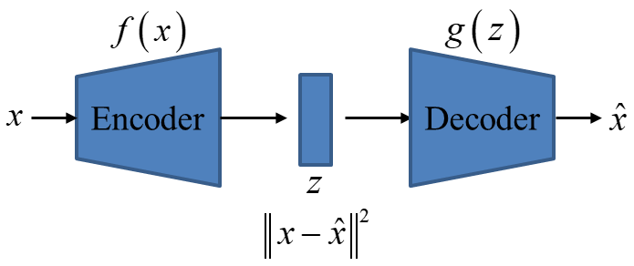
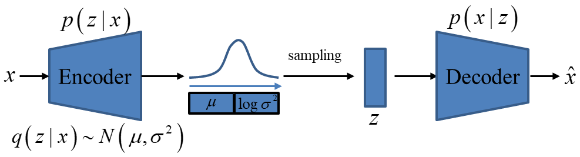
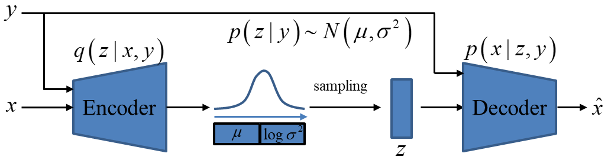

### AE (Autoencoder)

自编码的目的是：学习对高维数据做低维度“表示”。主要有两个部分组成：编码器和解码器

- 编码器训练得到函数 $\boldsymbol{f(·)}$
- 解码器训练得到函数 $\boldsymbol{g(·)}$

那么对于输入 $\boldsymbol{x}$，Encoder 编码过程为

$$\boldsymbol{z = f(X)}$$

其中 $\boldsymbol{z}$ 为编码向量，Decoder 解码过程为

$$\boldsymbol{\hat{x} = g(z)}$$

训练loss为重建损失

$$\boldsymbol{loss：||x-\hat{x}||}^2$$

这种方式编码向量 $\boldsymbol{z}$ 和输入 $\boldsymbol{x}$ 是对应的，只有与 $\boldsymbol{x}$ 对应的 $\boldsymbol{z}$ 才能通过解码过程重构 $\boldsymbol{x}$，任意的 $\boldsymbol{z}$ 通过解码过程重构结果没有明显的意义。这种方式只有降维编码的能力，没有diversity的生成能力。

### VAE (Variational Autoencoder)

变分自编码器在基本的自编码器的基础上引入了**概率模型**，编码器可将输入变量 $\boldsymbol{x}$ 映射到与变分分布的参数相对应的潜空间（Latent Space），这样便可以在这个潜空间中采样 $\boldsymbol{z}$ 来生成和 $\boldsymbol{x}$ 遵循同一分布的新样本 $\boldsymbol{\hat{x}}$。

本质上是在自编码器的基础上引入了噪声 $\sigma$，迫使模型去关注、抽象和编码那些重要、显著的特征，而基于这些特征，就可以生成新的和输入数据 **“和而不同”** 的样本，而不是像自编码器一样完全拟合输入数据且无法生成新的样本。

训练目标是从大量的观测数据 $\boldsymbol{x_i}$ 中总结出数据的分布 $\boldsymbol{p(x)}$，进而在这个分布中采样生成新的数据。然而分布 $\boldsymbol{p(x)}$ 不存在解析解，可以通过最大似然估计构建一个参数化的分布 $\boldsymbol{p_θ(x)}$ 来逼近分布 $\boldsymbol{p(x)}$，即 $\theta^*=\operatorname{argmin}_\theta\left(-\log \left(p_\theta(x)\right)\right)$。
假设一个数据由隐变量 $z$ 生成

$$ p_θ(x)=\int p_θ(x \mid z) p_θ(z) d z $$

其中：

- $p_θ(z)$ 是隐变量的先验分布（通常设为标准正态分布 N(0,I)）。
- $p_θ(x \mid z)$ 是生成模型。

直接计算 $p_θ(x)$ 很困难，因为积分高维隐变量 $z$ 通常不可解析。由于 $z$ 是通过编码 $x$ 得到的，所以可以用 $p_θ(z \mid x)$ 来代替 $p_θ(z)$，由贝叶斯定理：

$$
\begin{aligned}
p_\theta\left({z} \mid {x}\right) & =\frac{p_\theta\left({x} \mid {z}\right) p({z})}{p_\theta\left({x}\right)} \\
& =\frac{p_\theta\left({x} \mid {z}\right) p({z})}{\int_{\hat{{z}}} p_\theta\left({x} \mid \hat{{z}}\right) p(\hat{{z}}) {d} \hat{{z}}}
\end{aligned}
$$
但求解过程需要对 $z$ 进行大量采样，可以通过变分推断引入参数化分布 $q_θ(z \mid x)$ 来近似 $p_θ(z \mid x)$

$$
\begin{aligned}
\log p(x) & =\mathbb{E}_{q(z \mid x)}[\log p(x)] \\
& =\mathbb{E}_{q(z \mid x)}\left[\log \frac{p(x, z)}{p(z \mid x)}\right]=\mathbb{E}_{q(z \mid x)}\left[\log \frac{\textcolor{red}{q(z \mid x)} p(x, z)}{p(z \mid x) \textcolor{red}{q(z \mid x)}}\right] \\
& =\mathbb{E}_{q(z \mid x)}[\log p(x, z)-\log q(z \mid x)]+\underbrace{D_{K L}(q(z \mid x) \| p(z \mid x))}_{\geq 0} \\
& \geq \mathbb{E}_{q(z \mid x)}[\log p(x, z)-\log q(z \mid x)] \\
& :=E L B O \\
& =\mathbb{E}_{q(z \mid x)}[\log p(z)+\log p(x \mid z)-\log q(z \mid x)] \\
& =\underbrace{\mathbb{E}_{q(z \mid x)}[\log p(x \mid z)]}_{\text {Reconstruct term } L_{\text {Rec }}}-\underbrace{D_{K L}(q(z \mid x) \| p(z))}_{\text {KL term } L_{K L}}
\end{aligned}
$$

其中，

- 联合概率: $p(x, z) = p(z \mid x)p(x) = p(x \mid z)p(z)$
- 离散概率分布的KL散度: $K L(p \| q)=\sum p(x) \log \frac{p(x)}{q(x)}$
- 重构误差 $\mathbb{E}_{q(z \mid x)}[\log p(x \mid z)]$
    - 衡量生成数据 $x$ 与真实数据的相似程度。
    - 本质上是数据重建误差（通常使用对数似然表示）。
- 正则化项 $D_{K L}(q(z \mid x) \| p(z))$
    - 衡量近似后验 $q(z∣x)$ 与先验 $p(z)$ 的相似性。
    - 迫使隐变量 $z$ 遵循先验分布。

变分自编码器通过变分推理近似后验分布，最大化变分下界来进行训练，使用重构误差和KL散度联合优化模型，最终的目标是最大化 ELBO ，等价于最小化以下损失函数：

$$
\mathcal{L}=-\mathbb{E}_{q({z} \mid {x})}[\log p({x} \mid {z})]+\mathrm{KL}(q({z} \mid {x}) \| p({z}))
$$

在实现中：

- $q(z∣x)$ 通常通过神经网络参数化，设为高斯分布 $N(μ,diag(σ ^2))$。
- 重构误差根据具体任务计算，例如二值数据用交叉熵损失，多值数据用均方误差。

为了解决采样 $z∼q(z∣x)$ 导致的梯度不可传播问题，使用重参数化技巧：

$$
{z}={\mu}+{\sigma} \odot {\epsilon}, \quad {\epsilon} \sim \mathcal{N}(0, I)
$$

这样就可以通过 $μ$ 和 $σ$ 对损失函数进行反向传播。

### CVAE (Conditional Variational Autoencoder)

变分自编码器学习到的是数据的分布，从分布中的采样是任意的、不受控制的。要控制生成的数据，需要增加额外的条件。

条件变分自编码器在变分自编码器的基础上引入条件 $y$ 用于编码，同时也为采样过程提供先验分布信息，引入条件 $y$ 后，模型学习到一个条件分布 $p(x \mid y)$，从而能针对条件 $y$ 生成特定的数据 $x$。例如对于手写数字数据集 $D=\{(x_0,y_0),(x_1,y_1),(x_2,y_2),(x_3,y_3),...,(x_n,y_n)\}$，其中 $x_i$ 是图片数据，$y_i$ 是对应的 0~9 数字标签，在知道条件分布概率模型 $p(x \mid y)$ 后，我们就可以根据给定的标签来生成对应数字的图片。

目标函数是最大化 $\log p(x \mid y)$，即给定条件 $y$ 时 $x$ 的对数似然，通过学习一个潜在变量 z 的分布来实现条件概率分布的学习：

$$
\log p(x \mid y)=\log \int p(x, z \mid y) d z
$$

- $z∼p(z \mid x,y)$ 是编码的分布
- 解码器 $p(x \mid z,y)$ 用于生成数据

同样的直接优化上述的积分是非常困难的，因此使用一个参数化的分布 $q(z \mid x,y)$ 来近似分布 $p(z \mid x,y)$，通过变分推断的证据下界(ELBO)来进行优化：

$$
\begin{aligned}
\log p(x \mid y) & =\mathbb{E}_{q(z \mid x, y)}[\log p(x \mid y)] \\
& =\mathbb{E}_{q(z \mid x, y)}\left[\log \frac{p(x, z \mid y)}{p(z \mid x, y)}\right] \\
& =\mathbb{E}_{q(z \mid x, y)}\left[\log \frac{p(x, z \mid y)}{\textcolor{red}{q(z \mid x, y)}} \frac{\textcolor{red}{q(z \mid x, y)}}{p(z \mid x, y)}\right] \\
& =\mathbb{E}_{q(z \mid x, y)}[\log p(x, z \mid y)-\log q(z \mid x, y)]+\underbrace{D_{K L}(q(z \mid x, y) \| p(z \mid x, y))}_{\geq 0} \\
& \geq \mathbb{E}_{q(z \mid x, y)}[\log p(x, z \mid y)-\log q(z \mid x, y)] \\
& :=E L B O \\
& =\mathbb{E}_{q(z \mid x, y)}[\log p(z \mid y)+\log p(x \mid z, y)-\log q(z \mid x, y)] \\
& =\underbrace{\mathbb{E}_{q(z \mid x, y)}[\log p(x \mid z, y)]}_{\text {Reconstruct term } L_{\text {Rec }}}-\underbrace{D_{K L}(q(z \mid x, y) \| \textcolor{red}{p(z \mid y)})}_{\text {KL term } L_{K L}}
\end{aligned}
$$ 

其中，

- 联合概率分布和条件概率分布关系：$p(x, z \mid y)=p(x \mid z, y) p(z \mid y)=p(z \mid x, y) p(x \mid y)$
- 离散概率分布的KL散度: $K L(p \| q)=\sum p(x) \log \frac{p(x)}{q(x)}$
- ELBO包含两项：
     - 重构损失：$\mathbb{E}_{q(z \mid x, y)}[\log p(x \mid z, y)]$，是解码器的对数似然，表示生成数据 $x$ 的能力
     - KL散度损失：$D_{K L}(q(z \mid x, y) \| \textcolor{red}{p(z \mid y)})$，衡量近似后验 $q(z \mid x, y)$ 与先验 $p(z \mid y)$ 的差异。
- 如果条件 $y$ 和隐变量 $z$ 是相互独立的，则先验概率 $\textcolor{red}{p(z \mid y)} = \textcolor{red}{p(z)}$，则先验概率便可以和VAE一样，假设为已知的高斯分布，此时：

$$
\log p(x \mid y)=\underbrace{\mathbb{E}_{q(z \mid x, y)}[\log p(x \mid z, y)]}_{\text {Reconstruct term } L_{\text {Rec }}}-\underbrace{D_{K L}(q(z \mid x, y) \| \textcolor{red}{p(z)})}_{\text {KL term } L_{K L}}
$$

最终损失函数为：

$$
\mathcal{L}=-\mathbb{E}_{q(z \mid x, y)}[\log p(x \mid z, y)]+\operatorname{KL}(q(z \mid x, y) \| p(z \mid y))
$$

其中，
- 第一项为重构损失：$-\mathbb{E}_{q(z \mid x, y)}[\log p(x \mid z, y)]$，这部分可以用采样的 $z$ 来近似计算，通常通过解码器输出的重构误差（如均方误差或交叉熵）衡量。
- 第二项为KL散度损失：$\operatorname{KL}(q(z \mid x, y) \| p(z \mid y))$，当先验 $p(z \mid y)$ 是标准正态分布 $N(0,I)$，而 $q(z \mid x, y)$ 是高斯分布 $N(\mu,\sigma^2)$，KL散度有解析解：

$$
\mathrm{KL}=-\frac{1}{2} \sum_{i=1}^d\left(1+\log \sigma_i^2-\mu_i^2-\sigma_i^2\right)
$$

### reference

- https://zhuanlan.zhihu.com/p/389386601
- https://www.zywvvd.com/notes/study/deep-learning/generation/vae/cvae/cvae/
- https://blog.csdn.net/qq_25602729/article/details/119980336
- https://spaces.ac.cn/archives/5253
- https://spaces.ac.cn/archives/5343
- https://zh.wikipedia.org/wiki/%E8%B4%9D%E5%8F%B6%E6%96%AF%E5%AE%9A%E7%90%86
- https://blog.csdn.net/smileyan9/article/details/114986479
- https://www.zhangzhenhu.com/aigc/%E5%8F%98%E5%88%86%E8%87%AA%E7%BC%96%E7%A0%81%E5%99%A8.html
- https://www.jianshu.com/p/94d68a03c13e
- https://www.zywvvd.com/notes/study/deep-learning/generation/vae/cvae/cvae/
- https://zh.wikipedia.org/wiki/%E5%8F%98%E5%88%86%E8%87%AA%E7%BC%96%E7%A0%81%E5%99%A8
- https://chatgpt.com/
- https://papers.cool/arxiv/1312.6114